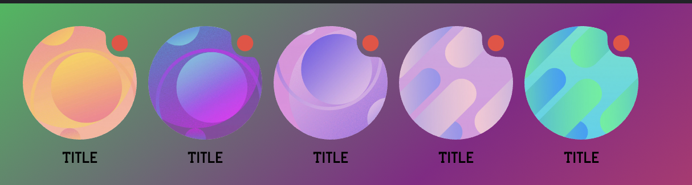

<p align="center"><a href="https://inappstory.com" target="_blank" rel="noopener noreferrer"></a></p>

# Stories Widget

This documentation is for version 2.7.0.

## Migration guide from 2.6.7 to 2.7.0
The default value of sharePanel.targets has changed\
v2.6.7 - ["vk", "facebook", "twitter", "linkedin"]\
v2.7.0 - ["vk", "facebook", "twitter", "linkedin", "telegram"]\
New fields in AppearanceCommonOptions (closeButtonPosition, closeButton, loaderColors) affect all readers (StoryReader, StoryFavoriteReader, GameReader)\
Readers loader default colors is now (color: "white", accentColor: "transparent")\
GameReader SplashScreen default background color - black


## Migration guide from 2.4.10 to 2.4.11
The signature of storyManager.showOnboardingStories method has changed\
2.4.10 version - showOnboardingStories(appearanceManager: AppearanceManager, customTags?: string);\
2.4.11 version - showOnboardingStories(appearanceManager: AppearanceManager, options?: {feed?: string, customTags?: string});


## Migration guide from 2.3.5 to 2.4.x
The signature of the StoriesList constructor has changed\
2.3.5 version - constructor(mountSelector: string, appearanceManager: AppearanceManager, feedSlug?: string);\
2.4.0 version - constructor(mountSelector: string, appearanceManager: AppearanceManager, options?: {feed?: string, testKey?: string});


## Migration guide from 2.2.x to 2.3.x
Changes event names for storiesList instance\
from "startLoading" and "endLoading" to "startLoad" and "endLoad"\
\
The status of loading storiesList is added to "endLoad" event\
\
Field "read" in [Slider card item options](#slider-card-options) changed to "opened"\
\
For use custom feed - pass feedSlug as third argument to StoriesList constructor\
Value by default - "default"\
const storiesList = new storyManager.StoriesList("#stories_widget", appearanceManager, "customFeed");


## Introduction

Web-sdk API lets you embed a Stories` widget on your website and control it using JavaScript.

## Getting started

```html
<!DOCTYPE html>
<head>
    <meta charset="utf-8"/>
</head>

<html>
<body>
<!-- 1. The <iframe> (and Stories` widget) will be mounted to this <div> tag -->
<div id="stories_widget"></div>

<script>
  // 2. This code loads the web-sdk API code asynchronously 
  // and create queue in global var window.IASReady.

  window.IASReady = (function (d, s, id) {
    var js, fjs = d.getElementsByTagName(s)[0], st = window.IASReady || {};
    if (d.getElementById(id)) return st;
    js = d.createElement(s);
    js.id = id;
    js.src = "https://sdk.inappstory.com/v2.7.0/dist/js/IAS.js";
    js.async = true;
    js.charset = "UTF-8";
    fjs.parentNode.insertBefore(js, fjs);
    st._e = [];
    st.ready = function (f) {
      st._e.push(f);
    };
    return st;
  }(document, "script", "ias-wjs"));

  // 3. This function creates an StoryManager instance (and StoriesList widget)
  //    after the API code downloads.
  window.IASReady.ready(function () {

    const storyManagerConfig = {
      apiKey: "{project-integration-key}",
      userId: "kdijhud4454d", // usually - hash from real user identifier
      tags: [], // Array<string>
      placeholders: {
        user: "Guest"
      },
      imagePlaceholders: {
        userAvatar: "image_url"
      },
      lang: "ru"
    };

    // StoryManager singleton instance
    const storyManager = new window.IAS.StoryManager(storyManagerConfig);

    // AppearanceManager instance
    const appearanceManager = new window.IAS.AppearanceManager();

    // appearance config
    appearanceManager.setCommonOptions({
      hasLike: true,
      hasFavorite: true, 
      closeButtonPosition: 'right',
    })
      .setStoriesListOptions({
        title: {
          content: 'The best stories',
          color: '#000',
          font: 'normal',
          marginBottom: 20,
        },
        card: {
          title: {
            color: 'black',
            font: '14px/16px "Segoe UI Semibold"',
            padding: 8
          },
          gap: 10,
          height: 100,
          variant: 'quad',
          border: {
            radius: 20,
            color: 'blue',
            width: 2,
            gap: 3,
          },
          boxShadow: null,
          opacity: 1,
          mask: {
            color: 'rgba(34, 34, 34, 0.3)'
          },
          opened: {
            border: {
              radius: null,
              color: 'red',
              width: null,
              gap: null,
            },
            boxShadow: null,
            opacity: null,
            mask: {
              color: 'rgba(34, 34, 34, 0.1)'
            },
          },
        },
        // favoriteCard: {},
        layout: {
          height: 0,
          backgroundColor: 'transparent'
        },
        sidePadding: 20,
        topPadding: 20,
        bottomPadding: 20,
        bottomMargin: 17,
        navigation: {
          showControls: false,
          controlsSize: 48,
          controlsBackgroundColor: 'white',
          controlsColor: 'black'
        },
      })
      .setStoryReaderOptions({
        scrollStyle: 'flat',
        sharePanel: {
            targets: ["facebook", "twitter", "vk", "linkedin", "telegram"]
        }
      }).setStoryFavoriteReaderOptions({
        title: {
            content: "Favorite",
            color: "white",
            font: "14px/16px InternalPrimaryFont",
            backgroundColor: "#333333"
        },
        backgroundColor: "#333333"
    });

    // mount and start StoriesList widget
    // #stories_widget - html element selectors
    const storiesList = new storyManager.StoriesList("#stories_widget", appearanceManager, {feed: "default"});

    // 4. Override default loading animation
    storiesList.on('startLoad', loaderContainer => loaderContainer.style.background = 'url("https://inappstory.com/stories/loader.gif") center / 45px auto no-repeat transparent');
    storiesList.on('endLoad', (loaderContainer, loadedStoriesLength) => {
      loaderContainer.style.background = 'none';
      // {defaultListLength: number, favoriteListLength: number}
      console.log({loadedStoriesLength});
    });
    
    // 5. Show onboarding example
    // showOnboardingStories(appearanceManager: AppearanceManager, {customTags?: string})
    // customTags - for override tags from storyManager
    // feed - for select another feed for onboarding (default feed - "onboarding")
    storyManager.showOnboardingStories(appearanceManager, {feed: "extraOnboarding"}).then(result => {
       console.log({showOnboardingStoriesResult: result});
       // result: boolean - were onboarding or not
    });
    // or window.IAS.StoryManager.getInstance()
      
    // 6. Add events for internal statistics (optional)
    const publicEvents = ['clickOnStory', 'showSlide', 'showStory', 'closeStory', 'clickOnButton', 'likeStory', 'dislikeStory', 'favoriteStory', 'shareStory', 'shareStoryWithPath', 'feedLoad', 'feedImpression'];
    publicEvents.forEach((eventName) => storyManager.on(eventName, (payload) => console.log("event", eventName, payload)));


  });


</script>
</body>
</html>
```

1. The `<div>` tag in this section identifies the location on the page where the web-sdk API will place the Stories
   widget. The constructor for the widget object, which is described in the Loading a Stories widget section, identifies
   the `<div>` tag by its id to ensure that the API places the `<iframe>` in the proper location.

2. The code in this section loads the web-sdk API JavaScript code. The example uses DOM modification to download the API
   code to ensure that the code is retrieved asynchronously. (The `<script>` tag's async attribute, which also enables
   asynchronous downloads, is not yet supported in all modern browsers as discussed in
   this [Stack Overflow answer](https://stackoverflow.com/a/1834129).

3. this function creates a widget constructor and adds it to the queue waiting for the API to load

4. The code in this section listens for the start and end events of the story feed widget. When loading starts - adds
   animation and removes when finished.

--- 

## Onboarding only example

```html
<!DOCTYPE html>
<html>
<body>
<!-- 1. The <iframe> (and Stories` widget) will be mounted to this <div> tag -->
<div id="stories_widget"></div>

<script>
  // 2. This code loads the web-sdk API code asynchronously 
  // and create queue in global var window.IASReady.

  window.IASReady = (function (d, s, id) {
    var js, fjs = d.getElementsByTagName(s)[0], st = window.IASReady || {};
    if (d.getElementById(id)) return st;
    js = d.createElement(s);
    js.id = id;
    js.src = "https://sdk.inappstory.com/v2.5.6/dist/js/IAS.js";
    js.async = true;
    fjs.parentNode.insertBefore(js, fjs);
    st._e = [];
    st.ready = function (f) {
      st._e.push(f);
    };
    return st;
  }(document, "script", "ias-wjs"));

  // 3. This function creates an StoryManager instance (and StoriesList widget)
  //    after the API code downloads.
  window.IASReady.ready(function () {

    const storyManagerConfig = {
      apiKey: "{project-integration-key}",
      userId: "kdijhud4454d", // usually - hash from real user identifier
      tags: [], // Array<string>
      placeholders: {
        user: "Guest"
      },
      imagePlaceholders: {
        userAvatar: "image_url"
      },
      lang: "ru"
    };

    // StoryManager singleton instance
    const storyManager = new window.IAS.StoryManager(storyManagerConfig);

    // AppearanceManager instance
    const appearanceManager = new window.IAS.AppearanceManager();

    // appearance config
    appearanceManager.setCommonOptions({
      hasLike: true,
      hasFavorite: true
    })
      .setStoryReaderOptions({
        closeButtonPosition: 'right',
        scrollStyle: 'flat',
        sharePanel: {
            targets: ["facebook", "twitter", "vk", "linkedin", "telegram"]
        }
      });

    // 4. Show onboarding example
      // showOnboardingStories(appearanceManager: AppearanceManager, {customTags?: string})
      // customTags - for override tags from storyManager
      // feed - for select another feed for onboarding (default feed - "onboarding")
    window.IAS.StoryManager.getInstance().showOnboardingStories(appearanceManager, {feed: "specialOnboarding"}).then(result => {
       console.log({showOnboardingStoriesResult: result});
       // result: boolean - were onboarding or not
    });

  });
  
</script>
</body>
</html>
```

---

## StoryManager public methods
```ts
type StoryManagerConfig = {
  apiKey: string;
  userId?: Optional<string|number>;
  tags?: Optional<Array<string>>;
  placeholders?: Optional<Dict<string>>;
  imagePlaceholders?: Optional<Dict<string>>; // since v2.4.2
  lang?: Optional<'ru' | 'en'>;
};

type StoryManagerCallbackPayload<T> = {src: 'storiesList' | 'storyReader', data: T};

enum StoriesEvents {
  CLICK_ON_STORY = 'clickOnStoryLink',
};

interface EventPayloadDataNameMap {
  "clickOnStoryLink": {id: number, index: number, url: string};
};

type StoryManagerCallbacks = {
  storyLinkClickHandler: (payload: StoryManagerCallbackPayload<{id: number, index: number, url: string}>) => void;
};

interface StoryManager {
  (config: StoryManagerConfig, callbacks?: StoryManagerCallbacks): StoryManager;
  getInstance(): StoryManager; // static
  setTags(tags: Array<string>): void;
  setUserId(userId: string | number): void;
  setLang(lang: 'ru' | 'en'): void;
  setPlaceholders(placeholders: Dict<string>): void;
  setImagePlaceholders(imagePlaceholders: Dict<string>): void; // since v2.4.2
  showStory(id: number | string, appearanceManager: AppearanceManager): Promise<boolean>;
  closeStoryReader(): void;
  // options.feed default value - "onboarding"
  //   options.limit - number, > 0, since v2.4.12
  showOnboardingStories(appearanceManager: AppearanceManager, options?: {feed?: string, customTags?: Array<string>, limit?: number}): Promise<boolean>;
  
  // callbaks
  set storyLinkClickHandler(payload: StoryManagerCallbackPayload<{id: number, index: number, url: string}>);

  // StoryManager property, you can set a callback that will be called before opening the reader
  onBeforeStoryReaderOpen: Option<() => Promise<void>>; // since v2.5.4
  //  callback that will be called after the reader is closed
  onStoryReaderClosed: Option<() => void>; // since v2.5.4

  // StoryManager property, you can set a callback that will be called before opening the favorites reader
  onBeforeFavoriteReaderOpen: Option<() => Promise<void>>; // since v2.5.4
  // callback that will be called after the reader is closed 
  onStoryReaderClosed: Option<() => void>; // since v2.5.4
  
  // events
  on<K extends keyof EventPayloadDataNameMap>(event: K, listener: (payload: StoryManagerCallbackPayload<EventPayloadDataNameMap[K]>) => void): StoryManager;
  once<K extends keyof EventPayloadDataNameMap>(event: K, listener: (payload: StoryManagerCallbackPayload<EventPayloadDataNameMap[K]>) => void): StoryManager;

  // info
  get sdkVersionName(): string; // since v2.6.3, return "2.6.3"  
  get sdkVersionCode(): number; // since v2.6.3, return 20603
    
}
```
[onBeforeStoryReaderOpen usage example](#onbeforestoryreaderopen-example)

## StoriesList public methods

```ts
interface StoriesList {
  (mountSelector: string, appearanceManager: AppearanceManager, options: {feed?: string|number, testKey?: string}): StoriesList;
  reload(options: {needLoader: boolean} = {needLoader: true}): Promise<boolean>;
  
  /**
   * Destroy widget and return widget parent element (with mountSelector) styles to init state
   * @since 2.4.0 
   */
  destroy(): void;
}
```

## UGCStoriesList public methods

```ts
interface UGCStoriesList {
  (mountSelector: string, appearanceManager: AppearanceManager, options: {filter: Record<string, any>}): StoriesList;
  reload(options: {needLoader: boolean} = {needLoader: true}): Promise<boolean>;
  destroy(): void;
}
```

## UGCStoriesList example

```ts
// StoryManager singleton instance
const storyManager = new window.IAS.StoryManager(storyManagerConfig);

// or get previously created (from page layout for example)
// const storyManager = window.IAS.StoryManager.getInstance();

// AppearanceManager instance
const appearanceManager = new window.IAS.AppearanceManager();

// List instance
const storiesList = new storyManager.UGCStoriesList("#stories_widget", appearanceManager, {filter: {prop1: "a", prop2: "b"}});

// subscribe on events
const publicEvents = ['clickOnStory', 'showSlide', 'showStory', 'closeStory', 'clickOnButton', 'likeStory', 'dislikeStory', 'favoriteStory', 'shareStory', 'shareStoryWithPath', 'clickOnFavoriteCell'];
publicEvents.forEach((eventName) => storyManager.on(eventName, (payload) => console.log("event", eventName, payload)));

// payload for all events from UGCStoiesList and StoryReader (for stories from UGCStoiesList)
type Payload = {
    id: number,
    index: number,
    isDeeplink: boolean,
    title: string,
    slidesCount: number,
    feed: null,
    filter: Record<string, any>,
    source: "list"
}

// subscribe and unsubscribe from event
const handler = (payload) => console.log("event", payload);
storyManager.on("storyManager", payload); // subscribe
storyManager.off("storyManager", payload); // unsubscribe


```


### StoryReader example of overriding the default behavior of a button
By default, the button from stories opens the link in the current window - window.open(url, '_self')
The default behavior can be overridden by setting the storyLinkClickHandler handler or the clickOnStoryLink event handler

```js
const urlHandler = ({ data }) => {
    // first close story reader (in the case of PWA for instance)
    storyManager.closeStoryReader();
    
    if (data.url.indexOf('custom-schema://') === 0) {
        // run custom action
    } else {
        // open url in the current window
        window.open(data.url, '_self');
        // or in the new window
        // window.open(url, '_blank');
    }
};

// set clickOnStoryLink event handler
storyManager.on("clickOnStoryLink", urlHandler);
// and remove on component destroy
// storyManager.off("clickOnStoryLink", urlHandler);

// or storyLinkClickHandler (if this option is more convenient)
// storyManager.storyLinkClickHandler = urlHandler;

```


### StoriesList reload example
```js
const storiesList = new storyManager.StoriesList("#stories_widget", appearanceManager);

storyManager.setTags(['msk']);

storiesList.reload();
// or without loader animation
// storiesList.reload({needLoader: false});

```

### Show single story example
```js

// StoryManager singleton instance
const storyManager = new window.IAS.StoryManager(storyManagerConfig);

// or get previously created (from page layout for example)
const storyManager = window.IAS.StoryManager.getInstance();

// AppearanceManager instance
const appearanceManager = new window.IAS.AppearanceManager();

// appearance config
appearanceManager.setCommonOptions({
  hasLike: true,
  hasFavorite: true
})
  .setStoryReaderOptions({
    closeButtonPosition: 'right',
    scrollStyle: 'flat',
    sharePanel: {
        targets: ["facebook", "twitter", "vk", "linkedin", "telegram"]
    }
  });

storyManager.showStory(125, appearanceManager).then(result => {
  console.log({showStoryResult: result});
});

```

### OnBeforeStoryReaderOpen example
```js

// StoryManager singleton instance
const storyManager = new window.IAS.StoryManager(storyManagerConfig);

// or get previously created (from page layout for example)
const storyManager = window.IAS.StoryManager.getInstance();

// AppearanceManager instance
const appearanceManager = new window.IAS.AppearanceManager();

// appearance config
appearanceManager.setCommonOptions({
  hasLike: true,
  hasFavorite: true
})
  .setStoryReaderOptions({
    closeButtonPosition: 'right',
    scrollStyle: 'flat',
    sharePanel: {
        targets: ["facebook", "twitter", "vk", "linkedin", "telegram"]
    }
  });

const hideAppTabBar = () => new Promise(resolve => {
    // ...
    resolve();
});
const showAppTabBar = () => true;
let isAnyReaderOpen = false;
let isFavoriteReaderOpen = false;
storyManager.onBeforeStoryReaderOpen = async () => {
    if (!isAnyReaderOpen) {
        isAnyReaderOpen = true;
        // wait for action
        await hideAppTabBar();
    }
};
storyManager.onBeforeFavoriteReaderOpen = async () => {
    isFavoriteReaderOpen = true;
    if (!isAnyReaderOpen) {
        isAnyReaderOpen = true;
        // wait for action
        await hideAppTabBar();
    }
};

storyManager.onStoryReaderClosed = () => {
    if (isFavoriteReaderOpen) return;
    isAnyReaderOpen = false;
    showAppTabBar();
};
storyManager.onFavoriteReaderClosed = () => {
    isFavoriteReaderOpen = false;
    isAnyReaderOpen = false;
    showAppTabBar();
};

const storiesList = new storyManager.StoriesList("#stories_widget", appearanceManager);

```


--- 

## storyManagerConfig

| Variable          | Type                             | Description                                                                                                        |
|-------------------|----------------------------------|--------------------------------------------------------------------------------------------------------------------|
| apiKey            | string                           | Your project integration key                                                                                       |
| userId            | string &#124; number &#124; null | User id                                                                                                            |
| tags              | Array<string>                    | Array of tags                                                                                                      |
| placeholders      | object                           | Dict for replace placeholders inside story content or title. Example: {user: "Guest"}                              |
| imagePlaceholders | object                           | Dict for replace imagePlaceholders inside story content or title. Example: {imgAvatar: "avatar_url"}. Since v2.4.2 |
| lang              | 'ru' &#124; 'en'                 | User locale                                                                                                        |

## AppearanceManager - AppearanceCommonOptions

| Variable                   | Type   | Description                                                                                         |
|----------------------------|--------|-----------------------------------------------------------------------------------------------------|
| closeButtonPosition        | string | Close button position, one of `left`, `right` (for all readers). Since v2.7.0                       |
| closeButton                | object | [Overload](#close-button-options) close button svg icon. (for all readers). Since v2.7.0            |
| loader.default.color       | string | Default loader primary color. Valid css color. Default - white (for all readers). Since v2.7.0      |
| loader.default.accentColor | string | Default loader accent color. Valid css color. Default - transparent (for all readers). Since v2.7.0 |


## AppearanceManager - StoriesListOptions

| Variable      | Type   | Description                                                                         |
|---------------|--------|-------------------------------------------------------------------------------------|
| title         | object | [Slider title options](#slider-title-options)                                       |
| card          | object | [Slider card item options](#slider-card-options)                                    |
| favoriteCard  | object | [Slider favorite card additional options](#slider-favorite-card-additional-options) |
| layout        | object | [Slider layout options](#slider-layout-options)                                     |
| sidePadding   | number | Slider side padding, `px`. Default 20                                               |
| topPadding    | number | Slider top padding, `px`. Default 20                                                |
| bottomPadding | number | Slider bottom padding, `px`. Default 20                                             |
| bottomMargin  | number | Slider bottom margin, `px`. Default 17                                              |
| navigation    | object | [Slider navigation options](#slider-navigation-options)                             |
| extraCss      | string | [Customize slider css](#customize-slider-css)                                       |

### Slider title options

| Variable     | Type               | Description                                                                                                                                                                                                                                             |
|--------------|--------------------|---------------------------------------------------------------------------------------------------------------------------------------------------------------------------------------------------------------------------------------------------------|
| content      | string &#124; null | Title text. Default null. Title block hidden when value is empty                                                                                                                                                                                        |
| color        | string             | CSS valid color value. Default `#ffffff`                                                                                                                                                                                                                |
| marginBottom | number             | Title block bottom margin, `px`. Default 20                                                                                                                                                                                                             |
| font         | string             | CSS valid font [value](https://developer.mozilla.org/en-US/docs/Web/CSS/font). Override font. <br/>Default `bold 20px/20px InternalPrimaryFont` where InternalPrimaryFont - primary font, loaded in [project settings](https://console.inappstory.com). | 

### Slider layout options

| Variable        | Type               | Description                                                                                    |
|-----------------|--------------------|------------------------------------------------------------------------------------------------|
| height          | number &#124; null | Slider total height, `px`. `0` - for auto height. Default `0`                                  |
| backgroundColor | string             | Default `transparent`                                                                          |
| sliderAlign     | string             | Horizontal align slider inside widget, variants: `left`, `center` and `right`. Default `left`. |

### Slider card options

| Variable        | Type                 | Description                                                                                                                                                                                                                                                                                                                                                                                                                                                     |
|-----------------|----------------------|-----------------------------------------------------------------------------------------------------------------------------------------------------------------------------------------------------------------------------------------------------------------------------------------------------------------------------------------------------------------------------------------------------------------------------------------------------------------|
| title           | object               | See below                                                                                                                                                                                                                                                                                                                                                                                                                                                       |
| title.display   | boolean              | Determines whether to show the title or not                                                                                                                                                                                                                                                                                                                                                                                                                     |
| title.position  | string               | Title position. Variants: `cardInsideBottom` (inside card, at bottom), `cardOutsideTop` (above the card) and `cardOutsideBottom`(under the card). Default - `cardInsideBottom`<br/> Note when using the `cardOutsideTop` or `cardOutsideBottom` option you must manually specify a [Slider layout height](#slider-layout-options) value. Usually this is the height of the card plus card title lineHeight * card title lineClamp + card title vertical padding |
| title.textAlign | string               | Text in title horizontal align, variants: `left`, `center` and `right`. Default `left`.                                                                                                                                                                                                                                                                                                                                                                         |
| title.lineClamp | number               | Numbers of text lines. Default 3.                                                                                                                                                                                                                                                                                                                                                                                                                               |
| title.color     | string               | CSS valid color value. Default `#ffffff`                                                                                                                                                                                                                                                                                                                                                                                                                        |
| title.padding   | number &#124; string | Number, `px` eq for all sides. <br/>String - valid css, for customizing each side. Default `15`                                                                                                                                                                                                                                                                                                                                                                 |
| title.font      | string               | CSS valid font [value](https://developer.mozilla.org/en-US/docs/Web/CSS/font). Override font. <br/>Default `normal 1rem InternalPrimaryFont` where InternalPrimaryFont - primary font, loaded in [project settings](https://console.inappstory.com).                                                                                                                                                                                                            | 
| gap             | number               | Space between cards, `px`. Default `10`                                                                                                                                                                                                                                                                                                                                                                                                                         |
| height          | number               | Card height, `px`. Default `70`                                                                                                                                                                                                                                                                                                                                                                                                                                 |
| variant         | string               | Card style, one of `circle`, `quad`, `rectangle`. Default `circle`                                                                                                                                                                                                                                                                                                                                                                                              |
| border          | object               | See below                                                                                                                                                                                                                                                                                                                                                                                                                                                       |
| border.radius   | number               | Card border radius, `px`. Default `0`                                                                                                                                                                                                                                                                                                                                                                                                                           |
| border.color    | string               | Card border color, valid css. Default `black`                                                                                                                                                                                                                                                                                                                                                                                                                   |
| border.width    | number               | Card border width, `px`. Default `2`                                                                                                                                                                                                                                                                                                                                                                                                                            |
| border.gap      | number               | Space between card and border, `px`. Default `3`                                                                                                                                                                                                                                                                                                                                                                                                                |
| boxShadow       | string &#124; null   | Card box-shadow, valid css value. Default `null`                                                                                                                                                                                                                                                                                                                                                                                                                |
| dropShadow      | string &#124; null   | Card drop-shadow, valid css value. Example - `1px 2px 8px rgba(34, 34, 34, 0.3)`. Default `null`. Since v2.4.0                                                                                                                                                                                                                                                                                                                                                  |
| opacity         | number               | Card opacity. Default `null`                                                                                                                                                                                                                                                                                                                                                                                                                                    |
| mask            | object &#124; null   | Card mask - overlay between card image and title. CSS valid color. Example - `rgba(0,0,0,.3)`. Default `null`                                                                                                                                                                                                                                                                                                                                                   |
| svgMask         | object &#124; null   | [Options](#slider-card-svg-masked-overlay) for card overlay with svg masks. Since v2.4.0                                                                                                                                                                                                                                                                                                                                                                        |
| opened          | object &#124; null   | Contain keys: `border`, `boxShadow`, `opacity`, `mask` <br />Apply this values (if current value not null) on card in `opened` state. Default all values null                                                                                                                                                                                                                                                                                                   |


### Slider card svg masked overlay
Since v2.4.0

Used to create effects like in the screenshot below

<p><a href="https://stackblitz.com/edit/angular-ivy-llsgys?file=src/app/app.component.ts" target="_blank" rel="noopener noreferrer"></a></p>

[Live Demo](https://stackblitz.com/edit/angular-ivy-llsgys?file=src/app/app.component.ts)


| Variable    | Type                               | Description                                 |
|-------------|------------------------------------|---------------------------------------------|
| cardMask    | string &#124; null                 | Svg source. Default null.                   |
| overlayMask | Array<OverlayMaskItem> &#124; null | Array of card overlay masks. Default null.  |


type OverlayMaskItem

| Variable   | Type               | Description                                                                                                       |
|------------|--------------------|-------------------------------------------------------------------------------------------------------------------|
| mask       | string &#124; null | Svg source. Default null.                                                                                         |
| background | string &#124; null | CSS color or any [background options](https://developer.mozilla.org/en-US/docs/Web/CSS/background). Default null. |

Note
Svg mask must match the size and shape of the card
The transparent part of the mask will cut out the content below it
svg tag should have width="100%" height="auto" and xmlns="http://www.w3.org/2000/svg" attributes

Example
```js
// Properties are shown only for svg masks
appearanceManager.setStoriesListOptions({
    svgMask: {
        cardMask: `<svg width="100%" height="auto" viewBox="0 0 140 140" fill="none" xmlns="http://www.w3.org/2000/svg">
<path fill-rule="evenodd" clip-rule="evenodd" d="M70 140C108.66 140 140 108.66 140 70C140 56.0958 135.946 43.1385 128.956 32.2455C126.219 35.1714 122.323 37 118 37C109.716 37 103 30.2843 103 22C103 17.6772 104.829 13.7814 107.755 11.0441C96.8615 4.05384 83.9042 0 70 0C31.3401 0 0 31.3401 0 70C0 108.66 31.3401 140 70 140Z" fill="#B6B6B6"/>
</svg>`,
        overlayMask: [{
            mask: `<svg width="100%" height="auto" viewBox="0 0 140 140" fill="none" xmlns="http://www.w3.org/2000/svg">
<path d="M128 22C128 27.5228 123.523 32 118 32C112.477 32 108 27.5228 108 22C108 16.4772 112.477 12 118 12C123.523 12 128 16.4772 128 22Z" fill="#B6B6B6"/>
</svg>`,
            background: "#F2473D",
        }]
    }
});
```

#### Card and overlay masks
<p>
    <br/>
    <span>Card mask</span>
</p>
<p>
    <br/>
    <span>Overlay card mask</span>
</p>


### Slider favorite card additional options

| Variable      | Type                 | Description                                                                                                                                                                                                                                          |
|---------------|----------------------|------------------------------------------------------------------------------------------------------------------------------------------------------------------------------------------------------------------------------------------------------|
| title         | object               | See below                                                                                                                                                                                                                                            |
| title.content | string               | Card title                                                                                                                                                                                                                                           |
| title.color   | string               | CSS valid color value. Default `#000000`                                                                                                                                                                                                             |
| title.padding | number &#124; string | Number, `px` eq for all sides. <br/>String - valid css, for customizing each side. Default `15`                                                                                                                                                      |
| title.font    | string               | CSS valid font [value](https://developer.mozilla.org/en-US/docs/Web/CSS/font). Override font. <br/>Default `normal 1rem InternalPrimaryFont` where InternalPrimaryFont - primary font, loaded in [project settings](https://console.inappstory.com). | 

### Slider navigation options

By default, controls are round buttons with arrow icons at the edges of the slider

| Variable                | Type        | Description                              |
|-------------------------|-------------|------------------------------------------|
| showControls            | boolean     | Enable slider controls. Default `false`  |
| controlsSize            | number      | Button size, `px`. Default `48`          |
| controlsBackgroundColor | string      | CSS valid color value. Default `#ffffff` |
| controlsColor           | string      | CSS valid color value. Default `#000000` |

### Customize slider css

Used for more complex customization of the slider appearance

Example with customization of navigation elements 
```js
appearanceManager.setStoriesListOptions({
    navigation: {
        showControls: true,
        controlsSize: 48,
        controlsBackgroundColor: 'white',
        controlsColor: 'black'
    },
    extraCss: `
        .stories-list-controls .control {
        background-color: transparent!important;
        width: 16px!important;
        height: 17px!important;
        }
        
        .stories-list-controls .control-left {
        bottom: 35px!important;
        left: 0!important;
        }
        .stories-list-controls .control-right {
        bottom: 35px!important;
        left: 34px!important;
        }
        .stories-list-controls .control-icon {
        background-color: #DCDCDC!important;
        width: 16px!important;
        height: 17px!important;
        }
        .stories-list-controls .control.active .control-icon {
        background-color: #0C62F3!important;
        }
        
        .stories-list-controls .control-left .control-icon {
        -webkit-mask-image: url("data:image/svg+xml,%3Csvg width='16' height='17' viewBox='0 0 16 17' fill='none' xmlns='http://www.w3.org/2000/svg'%3E%3Cpath d='M8.30078 15.9141L9.00391 15.2461C9.17969 15.0703 9.17969 14.7891 9.00391 14.6484L3.55469 9.16406H15.5781C15.7891 9.16406 16 8.98828 16 8.74219V7.75781C16 7.54688 15.7891 7.33594 15.5781 7.33594H3.55469L9.00391 1.88672C9.17969 1.74609 9.17969 1.46484 9.00391 1.28906L8.30078 0.621094C8.16016 0.445312 7.87891 0.445312 7.70312 0.621094L0.355469 7.96875C0.179688 8.14453 0.179688 8.39062 0.355469 8.56641L7.70312 15.9141C7.87891 16.0898 8.16016 16.0898 8.30078 15.9141Z' fill='currentColor'/%3E%3C/svg%3E%0A")!important;
        mask-image: url("data:image/svg+xml,%3Csvg width='16' height='17' viewBox='0 0 16 17' fill='none' xmlns='http://www.w3.org/2000/svg'%3E%3Cpath d='M8.30078 15.9141L9.00391 15.2461C9.17969 15.0703 9.17969 14.7891 9.00391 14.6484L3.55469 9.16406H15.5781C15.7891 9.16406 16 8.98828 16 8.74219V7.75781C16 7.54688 15.7891 7.33594 15.5781 7.33594H3.55469L9.00391 1.88672C9.17969 1.74609 9.17969 1.46484 9.00391 1.28906L8.30078 0.621094C8.16016 0.445312 7.87891 0.445312 7.70312 0.621094L0.355469 7.96875C0.179688 8.14453 0.179688 8.39062 0.355469 8.56641L7.70312 15.9141C7.87891 16.0898 8.16016 16.0898 8.30078 15.9141Z' fill='currentColor'/%3E%3C/svg%3E%0A")!important;
        }
        
        .stories-list-controls .control-right .control-icon {
        -webkit-mask-image: url("data:image/svg+xml, %3Csvg width='16' height='17' viewBox='0 0 16 17' fill='none' xmlns='http://www.w3.org/2000/svg'%3E%3Cpath d='M7.91406 0.621094L7.21094 1.28906C7.03516 1.46484 7.03516 1.74609 7.21094 1.88672L12.6602 7.33594H0.671875C0.425781 7.33594 0.25 7.54688 0.25 7.75781V8.74219C0.25 8.98828 0.425781 9.16406 0.671875 9.16406H12.6602L7.21094 14.6484C7.03516 14.7891 7.03516 15.0703 7.21094 15.2461L7.91406 15.9141C8.05469 16.0898 8.33594 16.0898 8.51172 15.9141L15.8594 8.56641C16.0352 8.39062 16.0352 8.14453 15.8594 7.96875L8.51172 0.621094C8.33594 0.445312 8.05469 0.445312 7.91406 0.621094Z' fill='currentColor'/%3E%3C/svg%3E")!important;
        mask-image: url("data:image/svg+xml, %3Csvg width='16' height='17' viewBox='0 0 16 17' fill='none' xmlns='http://www.w3.org/2000/svg'%3E%3Cpath d='M7.91406 0.621094L7.21094 1.28906C7.03516 1.46484 7.03516 1.74609 7.21094 1.88672L12.6602 7.33594H0.671875C0.425781 7.33594 0.25 7.54688 0.25 7.75781V8.74219C0.25 8.98828 0.425781 9.16406 0.671875 9.16406H12.6602L7.21094 14.6484C7.03516 14.7891 7.03516 15.0703 7.21094 15.2461L7.91406 15.9141C8.05469 16.0898 8.33594 16.0898 8.51172 15.9141L15.8594 8.56641C16.0352 8.39062 16.0352 8.14453 15.8594 7.96875L8.51172 0.621094C8.33594 0.445312 8.05469 0.445312 7.91406 0.621094Z' fill='currentColor'/%3E%3C/svg%3E")!important;
        }
        `
});
```

## AppearanceManager - StoryReaderOptions

| Variable                   | Type                    | Description                                                                                                             |
|----------------------------|-------------------------|-------------------------------------------------------------------------------------------------------------------------|
| closeButtonPosition        | string                  | Close button position, one of `left`, `right` (Override value from commonOptions, since v2.7.0)                         |
| scrollStyle                | string                  | Stories viewPager scroll style, one of `flat`, `cover`, `cube`                                                          |
| loader.default.color       | string                  | Default loader primary color. Valid css color. Default - white (Override value from commonOptions, since v2.7.0)        |
| loader.default.accentColor | string                  | Default loader accent color. Valid css color. Default - transparent (Override value from commonOptions, since v2.7.0)   |
| sharePanel                 | object                  | [Options](#share-panel-options) for SharePanel. Since v2.3.5                                                            |
| commonBackdrop             | object                  | [Options](#story-reader-backdrop-options) for StoryReader backdrop. Since v2.4.0                                        |
| slideBackdrop              | object                  | [Options](#story-reader-slide-backdrop-options) for StoryReader slide backdrop. Since v2.4.0                            |
| timelineBlockTopOffset     | number &#124; undefined | Configure timeline block top offset, `px` Default `5`. Also expands the backdrop below the block. Since v2.4.5          |
| actionPanelBottomOffset    | number &#124; undefined | Configure ActionPanel bottom offset, `px` Default `0`. Also expands the ActionPanel height. Since v2.4.6                |
| closeButton                | object                  | [Overload](#close-button-options) close button svg icon. Since v2.5.6 (Override value from commonOptions, since v2.7.0) |
| likeButton                 | object                  | [Overload](#like-button-options) like button svg icon. Since v2.5.6                                                     |
| dislikeButton              | object                  | [Overload](#dislike-button-options) dislike button svg icon. Since v2.5.6                                               |
| favoriteButton             | object                  | [Overload](#favorite-button-options) favorite button svg icon. Since v2.5.6                                             |
| muteButton                 | object                  | [Overload](#mute-button-options) mute button svg icon. Since v2.5.6                                                     |
| shareButton                | object                  | [Overload](#share-button-options) share button svg icon. Since v2.5.6                                                   |

## Share panel options

| Variable | Type          | Description                                                                                                                                       |
|----------|---------------|---------------------------------------------------------------------------------------------------------------------------------------------------|
| targets  | Array<string> | Available values: "vk", "twitter", "facebook", "linkedin", "telegram".<br/>Default value: \["vk", "facebook", "twitter", "linkedin", "telegram"\] |
telegram - available since v2.7.0\
Example 
```js
// AppearanceManager instance
const appearanceManager = new window.IAS.AppearanceManager();
appearanceManager.setStoryReaderOptions({
    closeButtonPosition: "right",
    scrollStyle: "flat",
    sharePanel: {
        targets: ["facebook", "twitter", "vk", "linkedin"]
    }
});
```

## Story reader backdrop options

| Variable       | Type               | Description                                                                                        |
|----------------|--------------------|----------------------------------------------------------------------------------------------------|
| color          | string             | StoryReader common backdrop - CSS valid color. Example - `rgba(0,0,0,.3)`. Default `rgba(0,0,0,1)` |
| backdropFilter | string &#124; null | StoryReader common backdrop filter. Example - `blur(10px)`. Default null                           |


## Story reader slide backdrop options

| Variable               | Type          | Description                                                                                                                       |
|------------------------|---------------|-----------------------------------------------------------------------------------------------------------------------------------|
| opacity                | number        | Slide based image backdrop - opacity value. Default `.56`                                                                         |
| blur                   | number        | Slide based image backdrop - blur value. Default `30`                                                                             |
| linearGradientOverlay  | Array<string> | Slide based image backdrop - Linear gradient overlay values. Default &#91;`rgba(0, 0, 0, 0.1) 0%`, `rgba(0, 0, 0, 0.9) 100%`&#93; |


### Close button options

| Variable         | Type   | Description                                                                                                                                                                                                                                                                                                                                                               |
|------------------|--------|---------------------------------------------------------------------------------------------------------------------------------------------------------------------------------------------------------------------------------------------------------------------------------------------------------------------------------------------------------------------------|
| svgSrc           | object | Svg button sources for different states. Button touchable size is 25x25px. You can use the icon up to these sizes.                                                                                                                                                                                                                                                        |
| svgSrc.baseState | string | Svg source. Default `<svg width="15" height="15" viewBox="0 0 15 15" fill="none" xmlns="http://www.w3.org/2000/svg"><path d="M6.96425 7.4645L0.142822 0.650209L0.649965 0.143066L7.46425 6.9645L14.2857 0.143066L14.7928 0.650209L7.97139 7.4645L14.7928 14.2859L14.2857 14.7931L7.46425 7.97164L0.649965 14.7931L0.142822 14.2859L6.96425 7.4645Z" fill="white"/></svg>` |


### Like button options

| Variable           | Type   | Description                                                                                                                                                                                                                                                                                                                                                                                                                                                                                                                                                                                                                                                                                                                                                                                                                                                                                                                                                                                                                                                                                                                                                                                                                                                                                                                                                                                                                                                                                                                                                                                                                                                                                                                                                                                                                                                                                                                     |
|--------------------|--------|---------------------------------------------------------------------------------------------------------------------------------------------------------------------------------------------------------------------------------------------------------------------------------------------------------------------------------------------------------------------------------------------------------------------------------------------------------------------------------------------------------------------------------------------------------------------------------------------------------------------------------------------------------------------------------------------------------------------------------------------------------------------------------------------------------------------------------------------------------------------------------------------------------------------------------------------------------------------------------------------------------------------------------------------------------------------------------------------------------------------------------------------------------------------------------------------------------------------------------------------------------------------------------------------------------------------------------------------------------------------------------------------------------------------------------------------------------------------------------------------------------------------------------------------------------------------------------------------------------------------------------------------------------------------------------------------------------------------------------------------------------------------------------------------------------------------------------------------------------------------------------------------------------------------------------|
| svgSrc             | object | Svg button sources for different states. Button touchable size is 50x50px. You can use the icon up to these sizes.                                                                                                                                                                                                                                                                                                                                                                                                                                                                                                                                                                                                                                                                                                                                                                                                                                                                                                                                                                                                                                                                                                                                                                                                                                                                                                                                                                                                                                                                                                                                                                                                                                                                                                                                                                                                              |
| svgSrc.baseState   | string | Svg source. Default `<svg width="26" height="26" viewBox="0 0 26 26" fill="none" xmlns="http://www.w3.org/2000/svg"><path d="M24.6527 13.0592C24.4045 13.5792 24.109 13.8392 23.7427 13.851C23.9402 14.0899 24.085 14.3678 24.1681 14.6664C24.2754 14.9702 24.3315 15.2897 24.3336 15.6119C24.3348 15.9936 24.2566 16.3714 24.1041 16.7214C23.9515 17.0713 23.7278 17.3858 23.4472 17.6446C23.6473 18.006 23.7492 18.4135 23.7427 18.8264C23.742 19.2612 23.6408 19.6899 23.4472 20.0792C23.2852 20.4586 23.0029 20.7743 22.6436 20.9773C22.6984 21.2896 22.7261 21.6058 22.7263 21.9228C22.7263 23.8255 21.6509 24.771 19.4763 24.771H17.4318C15.451 24.6867 13.4962 24.2878 11.6409 23.5892L11.1563 23.4001L10.5536 23.1873L9.96267 22.9864L9.31267 22.7973L8.75722 22.691C8.58024 22.6764 8.40238 22.6764 8.2254 22.691H7.68176V11.6764H8.27267C8.46193 11.6776 8.64992 11.6456 8.82813 11.5819C9.05683 11.4341 9.2671 11.2595 9.45449 11.0619C9.69085 10.861 9.90358 10.6483 10.1045 10.4592C10.3422 10.2191 10.5671 9.9666 10.7781 9.7028L11.369 8.98189L11.9009 8.28462L12.2909 7.76462C12.9054 6.99644 13.3427 6.47644 13.5909 6.21644C14.0779 5.68876 14.4234 5.04639 14.5954 4.34917C14.8081 3.5928 14.9854 2.88371 15.1154 2.21008C15.1935 1.67828 15.4185 1.17889 15.7654 0.768253C16.1631 0.714621 16.5679 0.758694 16.9447 0.896661C17.3215 1.03463 17.659 1.26233 17.9281 1.56008C18.3401 2.31941 18.5286 3.17988 18.4718 4.04189C18.4115 4.993 18.1581 5.92186 17.7272 6.77189C17.272 7.61247 16.9944 8.5377 16.9118 9.49008H22.8209C23.3921 9.51353 23.9334 9.75175 24.3365 10.1571C24.7398 10.5625 24.9751 11.1051 24.9954 11.6764C24.9759 12.1558 24.8593 12.6261 24.6527 13.0592Z" stroke="white" stroke-width="1.18182" stroke-miterlimit="10"/><path d="M5.90904 11.8184H1.18176V22.4547H5.90904V11.8184Z" stroke="white" stroke-width="1.18182" stroke-miterlimit="10"/></svg>`                           |
| svgSrc.activeState | string | Svg source. Default `<svg width="26" height="26" viewBox="0 0 26 26" fill="none" xmlns="http://www.w3.org/2000/svg"><path d="M24.6527 13.0592C24.4045 13.5792 24.109 13.8392 23.7427 13.851C23.9402 14.0899 24.085 14.3678 24.1681 14.6664C24.2754 14.9702 24.3315 15.2897 24.3336 15.6119C24.3348 15.9936 24.2566 16.3714 24.1041 16.7214C23.9515 17.0713 23.7278 17.3858 23.4472 17.6446C23.6473 18.006 23.7492 18.4135 23.7427 18.8264C23.742 19.2612 23.6408 19.6899 23.4472 20.0792C23.2852 20.4586 23.0029 20.7743 22.6436 20.9773C22.6984 21.2896 22.7261 21.6058 22.7263 21.9228C22.7263 23.8255 21.6509 24.771 19.4763 24.771H17.4318C15.451 24.6867 13.4962 24.2878 11.6409 23.5892L11.1563 23.4001L10.5536 23.1873L9.96267 22.9864L9.31267 22.7973L8.75722 22.691C8.58024 22.6764 8.40238 22.6764 8.2254 22.691H7.68176V11.6764H8.27267C8.46193 11.6776 8.64992 11.6456 8.82813 11.5819C9.05683 11.4341 9.2671 11.2595 9.45449 11.0619C9.69085 10.861 9.90358 10.6483 10.1045 10.4592C10.3422 10.2191 10.5671 9.9666 10.7781 9.7028L11.369 8.98189L11.9009 8.28462L12.2909 7.76462C12.9054 6.99644 13.3427 6.47644 13.5909 6.21644C14.0779 5.68876 14.4234 5.04639 14.5954 4.34917C14.8081 3.5928 14.9854 2.88371 15.1154 2.21008C15.1935 1.67828 15.4185 1.17889 15.7654 0.768253C16.1631 0.714621 16.5679 0.758694 16.9447 0.896661C17.3215 1.03463 17.659 1.26233 17.9281 1.56008C18.3401 2.31941 18.5286 3.17988 18.4718 4.04189C18.4115 4.993 18.1581 5.92186 17.7272 6.77189C17.272 7.61247 16.9944 8.5377 16.9118 9.49008H22.8209C23.3921 9.51353 23.9334 9.75175 24.3365 10.1571C24.7398 10.5625 24.9751 11.1051 24.9954 11.6764C24.9759 12.1558 24.8593 12.6261 24.6527 13.0592Z" fill="white" stroke="white" stroke-width="1.18182" stroke-miterlimit="10"/><path d="M5.90904 11.8184H1.18176V22.4547H5.90904V11.8184Z" fill="white" stroke="white" stroke-width="1.18182" stroke-miterlimit="10"/></svg>` |


### Dislike button options

| Variable           | Type   | Description                                                                                                                                                                                                                                                                                                                                                                                                                                                                                                                                                                                                                                                                                                                                                                                                                                                                                                                                                                                                                                                                                                                                                                                                                                                                                                                                                                                                                                                                                                                                                                                                                                                                                                                                                                                                                                                                                                                                                                                |
|--------------------|--------|--------------------------------------------------------------------------------------------------------------------------------------------------------------------------------------------------------------------------------------------------------------------------------------------------------------------------------------------------------------------------------------------------------------------------------------------------------------------------------------------------------------------------------------------------------------------------------------------------------------------------------------------------------------------------------------------------------------------------------------------------------------------------------------------------------------------------------------------------------------------------------------------------------------------------------------------------------------------------------------------------------------------------------------------------------------------------------------------------------------------------------------------------------------------------------------------------------------------------------------------------------------------------------------------------------------------------------------------------------------------------------------------------------------------------------------------------------------------------------------------------------------------------------------------------------------------------------------------------------------------------------------------------------------------------------------------------------------------------------------------------------------------------------------------------------------------------------------------------------------------------------------------------------------------------------------------------------------------------------------------|
| svgSrc             | object | Svg button sources for different states. Button touchable size is 50x50px. You can use the icon up to these sizes.                                                                                                                                                                                                                                                                                                                                                                                                                                                                                                                                                                                                                                                                                                                                                                                                                                                                                                                                                                                                                                                                                                                                                                                                                                                                                                                                                                                                                                                                                                                                                                                                                                                                                                                                                                                                                                                                         |
| svgSrc.baseState   | string | Svg source. Default `<svg width="27" height="26" viewBox="0 0 27 26" fill="none" xmlns="http://www.w3.org/2000/svg"><path d="M1.95728 12.9407C2.20547 12.4207 2.50092 12.1607 2.86728 12.1489C2.67612 11.9058 2.53186 11.6293 2.44183 11.3334C2.34019 11.0282 2.28443 10.7096 2.27637 10.388C2.27385 10.0067 2.35266 9.62916 2.50754 9.28068C2.66242 8.9322 2.88981 8.62075 3.17456 8.36709C2.96718 8.00817 2.86098 7.59974 2.86728 7.18527C2.86805 6.75051 2.96916 6.32181 3.16274 5.93254C3.31795 5.55004 3.59121 5.22709 3.94274 5.01072C3.91641 4.70402 3.91641 4.39561 3.94274 4.0889C3.94274 2.18618 5.01819 1.24072 7.19274 1.24072H9.17819C11.159 1.32494 13.1138 1.72386 14.9691 2.42254L15.4655 2.59981L16.0564 2.81254L16.6591 3.01345L17.2973 3.20254L17.8527 3.3089C18.0297 3.32349 18.2075 3.32349 18.3846 3.3089H18.9282V14.2171H18.3846C18.1756 14.2289 17.9709 14.281 17.7818 14.3707C17.5397 14.497 17.3136 14.6517 17.1082 14.8316L16.4582 15.4344C16.2205 15.6744 15.9956 15.927 15.7846 16.1907L15.1937 16.9116L14.6618 17.6089L14.2718 18.1289C13.6573 18.8971 13.22 19.4171 12.9718 19.6771C12.4848 20.2048 12.1392 20.8471 11.9673 21.5444C11.7546 22.3007 11.5773 23.0098 11.4473 23.6835C11.3757 24.2149 11.1544 24.715 10.8091 25.1253C10.4238 25.1872 10.0292 25.1575 9.65757 25.0384C9.28589 24.9193 8.94755 24.7142 8.67001 24.4398C8.25902 23.6844 8.07052 22.8279 8.12637 21.9698C8.19097 21 8.4566 20.0542 8.90637 19.1926C9.36165 18.3519 9.63922 17.4267 9.72183 16.4744H3.81274C3.5291 16.4711 3.24901 16.4108 2.98914 16.2971C2.72926 16.1834 2.4949 16.0187 2.30001 15.8126C2.08491 15.6264 1.91004 15.3983 1.78609 15.1423C1.66213 14.8862 1.5917 14.6076 1.5791 14.3235C1.6097 13.8416 1.73839 13.371 1.95728 12.9407Z" stroke="white" stroke-width="1.18182" stroke-miterlimit="10"/><path d="M25.4282 3.54541H20.7009V14.1818H25.4282V3.54541Z" stroke="white" stroke-width="1.18182" stroke-miterlimit="10"/></svg>`                            |
| svgSrc.activeState | string | Svg source. Default `<svg width="27" height="26" viewBox="0 0 27 26" fill="none" xmlns="http://www.w3.org/2000/svg"><path d="M1.95728 12.9407C2.20547 12.4207 2.50092 12.1607 2.86728 12.1489C2.67612 11.9058 2.53186 11.6293 2.44183 11.3334C2.34019 11.0282 2.28443 10.7096 2.27637 10.388C2.27385 10.0067 2.35266 9.62916 2.50754 9.28068C2.66242 8.9322 2.88981 8.62075 3.17456 8.36709C2.96718 8.00817 2.86098 7.59974 2.86728 7.18527C2.86805 6.75051 2.96916 6.32181 3.16274 5.93254C3.31795 5.55004 3.59121 5.22709 3.94274 5.01072C3.91641 4.70402 3.91641 4.39561 3.94274 4.0889C3.94274 2.18618 5.01819 1.24072 7.19274 1.24072H9.17819C11.159 1.32494 13.1138 1.72386 14.9691 2.42254L15.4655 2.59981L16.0564 2.81254L16.6591 3.01345L17.2973 3.20254L17.8527 3.3089C18.0297 3.32349 18.2075 3.32349 18.3846 3.3089H18.9282V14.2171H18.3846C18.1756 14.2289 17.9709 14.281 17.7818 14.3707C17.5397 14.497 17.3136 14.6517 17.1082 14.8316L16.4582 15.4344C16.2205 15.6744 15.9956 15.927 15.7846 16.1907L15.1937 16.9116L14.6618 17.6089L14.2718 18.1289C13.6573 18.8971 13.22 19.4171 12.9718 19.6771C12.4848 20.2048 12.1392 20.8471 11.9673 21.5444C11.7546 22.3007 11.5773 23.0098 11.4473 23.6835C11.3757 24.2149 11.1544 24.715 10.8091 25.1253C10.4238 25.1872 10.0292 25.1575 9.65757 25.0384C9.28589 24.9193 8.94755 24.7142 8.67001 24.4398C8.25902 23.6844 8.07052 22.8279 8.12637 21.9698C8.19097 21 8.4566 20.0542 8.90637 19.1926C9.36165 18.3519 9.63922 17.4267 9.72183 16.4744H3.81274C3.5291 16.4711 3.24901 16.4108 2.98914 16.2971C2.72926 16.1834 2.4949 16.0187 2.30001 15.8126C2.08491 15.6264 1.91004 15.3983 1.78609 15.1423C1.66213 14.8862 1.5917 14.6076 1.5791 14.3235C1.6097 13.8416 1.73839 13.371 1.95728 12.9407Z" fill="white" stroke="white" stroke-width="1.18182" stroke-miterlimit="10"/><path d="M25.4282 3.54541H20.7009V14.1818H25.4282V3.54541Z" fill="white" stroke="white" stroke-width="1.18182" stroke-miterlimit="10"/></svg>`  |


### Favorite button options

| Variable           | Type   | Description                                                                                                                                                                                                                                                                                                                                                                                                                          |
|--------------------|--------|--------------------------------------------------------------------------------------------------------------------------------------------------------------------------------------------------------------------------------------------------------------------------------------------------------------------------------------------------------------------------------------------------------------------------------------|
| svgSrc             | object | Svg button sources for different states. Button touchable size is 50x50px. You can use the icon up to these sizes.                                                                                                                                                                                                                                                                                                                   |
| svgSrc.baseState   | string | Svg source. Default `<svg width="22" height="26" viewBox="0 0 22 26" fill="none" xmlns="http://www.w3.org/2000/svg"><path d="M17.66 3.81982H4.81116C4.25887 3.81982 3.81116 4.26754 3.81116 4.81982V21.2171C3.81116 22.062 4.83134 22.4865 5.4307 21.8911L11.24 16.1198L17.0401 21.8888C17.6393 22.4847 18.66 22.0603 18.66 21.2152L18.66 4.81983C18.66 4.26754 18.2123 3.81982 17.66 3.81982Z" stroke="white"/></svg>`              |
| svgSrc.activeState | string | Svg source. Default `<svg width="22" height="26" viewBox="0 0 22 26" fill="none" xmlns="http://www.w3.org/2000/svg"><path d="M17.66 3.81982H4.81116C4.25887 3.81982 3.81116 4.26754 3.81116 4.81982V21.2171C3.81116 22.062 4.83134 22.4865 5.4307 21.8911L11.24 16.1198L17.0401 21.8888C17.6393 22.4847 18.66 22.0603 18.66 21.2152L18.66 4.81983C18.66 4.26754 18.2123 3.81982 17.66 3.81982Z" fill="white" stroke="white"/></svg>` |


### Mute button options

| Variable           | Type   | Description                                                                                                                                                                                                                                                                                                                                                                                                                                                                                                                                                                                                                                                                                                                                                                                                                                                                                                                                                                                                                                                                                                                                                                                                                                                                                                                                                                                                                                                                                                                                                                                                                                                                                                                                                                                                                                                        |
|--------------------|--------|--------------------------------------------------------------------------------------------------------------------------------------------------------------------------------------------------------------------------------------------------------------------------------------------------------------------------------------------------------------------------------------------------------------------------------------------------------------------------------------------------------------------------------------------------------------------------------------------------------------------------------------------------------------------------------------------------------------------------------------------------------------------------------------------------------------------------------------------------------------------------------------------------------------------------------------------------------------------------------------------------------------------------------------------------------------------------------------------------------------------------------------------------------------------------------------------------------------------------------------------------------------------------------------------------------------------------------------------------------------------------------------------------------------------------------------------------------------------------------------------------------------------------------------------------------------------------------------------------------------------------------------------------------------------------------------------------------------------------------------------------------------------------------------------------------------------------------------------------------------------|
| svgSrc             | object | Svg button sources for different states. Button touchable size is 50x50px. You can use the icon up to these sizes.                                                                                                                                                                                                                                                                                                                                                                                                                                                                                                                                                                                                                                                                                                                                                                                                                                                                                                                                                                                                                                                                                                                                                                                                                                                                                                                                                                                                                                                                                                                                                                                                                                                                                                                                                 |
| svgSrc.baseState   | string | Sound off state. Svg source. Default `<svg width="22" height="26" viewBox="0 0 22 26" fill="none" xmlns="http://www.w3.org/2000/svg"><path d="M14.2206 22.3918C14.0256 22.3451 12.4651 21.4429 10.7096 20.3773L7.54973 18.456H5.50554H3.46136L3.2429 18.2693L3.02444 18.0827L3.00883 12.8401C2.98543 7.36426 2.98542 7.35648 3.31312 7.14646C3.43015 7.07646 3.55499 7.16202 4.09334 7.7065C4.69411 8.29764 4.72532 8.34431 4.52246 8.34431H4.3118V12.739V17.1337H5.67719H7.04258V13.8902V10.6389L11.8878 15.4614L16.733 20.2839L16.6939 20.6806C16.5769 21.8707 15.3598 22.7107 14.2206 22.3918Z" fill="white"/><path d="M11.1933 13.3847C5.39627 7.59765 3.89824 6.07312 3.82802 5.83977C3.65637 5.2564 4.24934 4.60303 4.86571 4.7197C5.09198 4.75859 6.23891 5.87088 12.4495 12.0624L19.7602 19.3506V19.7317C19.7602 20.0507 19.7212 20.144 19.4949 20.3696C19.2686 20.5951 19.175 20.634 18.8551 20.634H18.4728L11.1933 13.3847Z" fill="white"/><path d="M12.5196 10.6545L8.35327 6.50095L9.00866 6.11204C9.36756 5.90203 10.6471 5.1242 11.8564 4.40083C13.6587 3.30409 14.1191 3.06297 14.4468 3.0163C15.2894 2.89962 16.2101 3.42077 16.5534 4.21415C16.7172 4.60306 16.7172 4.63417 16.7016 9.70559L16.6782 14.8003L12.5196 10.6545Z" fill="white"/></svg>`                                                                                                                                                                                                                                                                                                                                                                                                                                                                                                                                                                                               |
| svgSrc.activeState | string | Sound on state. Svg source. Default `<svg width="22" height="26" viewBox="0 0 22 26" fill="none" xmlns="http://www.w3.org/2000/svg"><path d="M12.0512 22.4247C11.886 22.3646 10.1891 21.4561 8.28942 20.3974L4.83549 18.4677H2.59795H0.367918L0.187713 18.28L0 18.0998V12.7687V7.44518L0.232764 7.24996L0.465529 7.05474H2.67304H4.88805L8.13174 5.23767C9.91877 4.24655 11.5556 3.34552 11.7809 3.24041C12.8246 2.75986 14.1311 3.19535 14.6567 4.19399L14.8669 4.59194V12.7612C14.8669 21.8616 14.9044 21.1858 14.3338 21.809C13.8082 22.3796 12.772 22.6575 12.0512 22.4247ZM13.0874 21.0807C13.4478 20.893 13.4328 21.2233 13.4403 12.7762V4.78716L13.215 4.56191C12.8171 4.16395 12.7195 4.2015 9.07031 6.23631L5.78908 8.06839L5.78157 12.7687V17.4616L9.10034 19.3162C12.5242 21.2308 12.6819 21.2984 13.0874 21.0807ZM4.35495 12.7612V8.33119H2.89078H1.42662V12.7612V17.1912H2.89078H4.35495V12.7612Z" fill="white"/><path d="M19.3045 16.5456C18.9516 16.2528 18.9891 15.9975 19.4471 15.4794C20.1304 14.7135 20.4683 13.9552 20.5434 13.0241C20.626 12.018 20.2355 10.9443 19.4847 10.1333C19.0116 9.61525 18.9591 9.36747 19.2519 9.02958C19.4021 8.85689 19.4922 8.81934 19.785 8.81934C20.1304 8.81934 20.1604 8.84187 20.626 9.33743C21.2041 9.96064 21.7222 10.9593 21.8949 11.7852C22.2328 13.3845 21.6321 15.2767 20.4382 16.3879C19.9727 16.8159 19.6724 16.8535 19.3045 16.5456Z" fill="white"/><path d="M17.2246 14.6384C17.0218 14.5558 16.8191 14.278 16.8191 14.0753C16.8191 13.9927 16.9317 13.7599 17.0744 13.5647C17.5174 12.9415 17.5174 12.5285 17.0744 12.0029C16.9317 11.8377 16.8191 11.635 16.8191 11.5599C16.8191 11.0869 17.3071 10.734 17.7577 10.8841C18.0655 10.9817 18.4334 11.3872 18.6512 11.8527C18.8914 12.3859 18.8689 13.1968 18.5986 13.7524C18.2232 14.5108 17.7201 14.8411 17.2246 14.6384Z" fill="white"/></svg>` |


### Share button options

| Variable           | Type   | Description                                                                                                                                                                                                                                                                                                                                                                                                                                                                                                                                                                                                                                                                                                                                                                                                                                                                                                                                                                                                                                                                                                                                                                                                                                                                                                                                                                                                                                                                                                                                                                                                        |
|--------------------|--------|--------------------------------------------------------------------------------------------------------------------------------------------------------------------------------------------------------------------------------------------------------------------------------------------------------------------------------------------------------------------------------------------------------------------------------------------------------------------------------------------------------------------------------------------------------------------------------------------------------------------------------------------------------------------------------------------------------------------------------------------------------------------------------------------------------------------------------------------------------------------------------------------------------------------------------------------------------------------------------------------------------------------------------------------------------------------------------------------------------------------------------------------------------------------------------------------------------------------------------------------------------------------------------------------------------------------------------------------------------------------------------------------------------------------------------------------------------------------------------------------------------------------------------------------------------------------------------------------------------------------|
| svgSrc             | object | Svg button sources for different states. Button touchable size is 50x50px. You can use the icon up to these sizes.                                                                                                                                                                                                                                                                                                                                                                                                                                                                                                                                                                                                                                                                                                                                                                                                                                                                                                                                                                                                                                                                                                                                                                                                                                                                                                                                                                                                                                                                                                 |
| svgSrc.baseState   | string | Svg source. Default `<svg width="26" height="26" viewBox="0 0 26 26" fill="none" xmlns="http://www.w3.org/2000/svg"><path d="M14.7727 4.84545C14.7727 5.43636 14.8909 6.02727 15.0091 6.5L8.98182 9.92727C8.03636 8.86364 6.61818 8.15455 5.08182 8.15455C2.36364 8.03636 0 10.2818 0 13C0 15.7182 2.24545 17.8455 5.08182 17.8455C6.61818 17.8455 8.03636 17.1364 8.98182 16.0727L15.0091 19.3818C14.7727 19.8545 14.7727 20.4455 14.7727 21.0364C14.7727 23.7545 17.0182 25.8818 19.8545 25.8818C22.6909 25.8818 24.9364 23.6364 24.9364 21.0364C24.9364 18.3182 22.6909 16.0727 19.8545 16.0727C18.3182 16.0727 16.9 16.7818 15.9545 17.8455L9.92727 14.5364C10.0455 14.1818 10.1636 13.5909 10.1636 13C10.1636 12.4091 10.0455 11.8182 9.92727 11.3455L15.9545 8.03636C16.9 9.1 18.3182 9.80909 19.8545 9.80909C22.6909 9.80909 24.9364 7.56364 24.9364 4.84545C24.9364 2.12727 22.6909 0 19.8545 0C17.0182 0 14.7727 2.24545 14.7727 4.84545ZM5.08182 16.1909C3.30909 16.1909 1.77273 14.7727 1.77273 13C1.77273 11.2273 3.30909 9.80909 5.08182 9.80909C6.85455 9.80909 8.39091 11.2273 8.39091 13C8.39091 14.7727 6.97273 16.1909 5.08182 16.1909ZM19.8545 17.8455C21.6273 17.8455 23.1636 19.2636 23.1636 21.0364C23.1636 22.8091 21.6273 24.2273 19.8545 24.2273C18.0818 24.2273 16.5455 22.8091 16.5455 21.0364C16.5455 19.3818 18.0818 17.8455 19.8545 17.8455ZM19.8545 1.77273C21.6273 1.77273 23.1636 3.19091 23.1636 4.96364C23.1636 6.73636 21.6273 8.15455 19.8545 8.15455C18.0818 8.15455 16.5455 6.73636 16.5455 4.96364C16.5455 3.19091 18.0818 1.77273 19.8545 1.77273Z" fill="white"/></svg>` |


Examples
```js
const appearanceManager = new window.IAS.AppearanceManager();

// Copy of default config
appearanceManager.setStoryReaderOptions({
    commonBackdrop: {
        color: "rgba(51, 51, 51, 1)",
        backdropFilter: null
    },
    slideBackdrop: {
        opacity: .56,
        blur: 30,
        linearGradientOverlay: [
            "rgba(0, 0, 0, 0.1) 0%",
            "rgba(0, 0, 0, 0.9) 100%"
        ]
    }
});

// Translucent config without slide based backdrop image
appearanceManager.setStoryReaderOptions({
    commonBackdrop: {
        color: "rgba(51, 51, 51, .8)",
        backdropFilter: null
    },
    slideBackdrop: {
        opacity: 0,
        blur: 30,
        linearGradientOverlay: [
            "rgba(0, 0, 0, 0.1) 0%",
            "rgba(0, 0, 0, 0.9) 100%"
        ]
    }
});

// Translucent config without slide based backdrop image and parent screen blur effect
appearanceManager.setStoryReaderOptions({
    commonBackdrop: {
        color: "rgba(51, 51, 51, .2)",
        backdropFilter: "blur(5px)"
    },
    slideBackdrop: {
        opacity: 0,
        blur: 30,
        linearGradientOverlay: [
            "rgba(0, 0, 0, 0.1) 0%",
            "rgba(0, 0, 0, 0.9) 100%"
        ]
    }
});

```

## AppearanceManager - Overload StoryReader icons

```js
const appearanceManager = new window.IAS.AppearanceManager();

appearanceManager.setStoryReaderOptions({
    closeButton: {
        svgSrc: {
            baseState: `<svg/>`
        }
    },
    likeButton: {
        svgSrc: {
            baseState: `<svg/>`,
            activeState: `<svg/>`,
        }
    },
    dislikeButton: {
        svgSrc: {
            baseState: `<svg/>`,
            activeState: `<svg/>`,
        }
    },
    favoriteButton: {
        svgSrc: {
            baseState: `<svg/>`,
            activeState: `<svg/>`,
        }
    },
    muteButton: {
        svgSrc: {
            baseState: `<svg/>`,
            activeState: `<svg/>`,
        }
    },
    shareButton: {
        svgSrc: {
            baseState: `<svg/>`,
        }
    },
});

```

## AppearanceManager - StoryFavoriteReaderOptions
since v2.3.1

| Variable              | Type    | Description                                                                                                                                                                                                                                                |
|-----------------------|---------|------------------------------------------------------------------------------------------------------------------------------------------------------------------------------------------------------------------------------------------------------------|
| title.content         | string  | Title text. Default value - "Favorite".                                                                                                                                                                                                                    |
| title.color           | string  | CSS valid color value. Default `white`                                                                                                                                                                                                                     |
| title.font            | string  | CSS valid font [value](https://developer.mozilla.org/en-US/docs/Web/CSS/font). Override font. <br/>Default `normal 1.4rem/1.2 InternalPrimaryFont` where InternalPrimaryFont - primary font, loaded in [project settings](https://console.inappstory.com). | 
| title.backgroundColor | string  | StoryFavoriteReader header bg color. CSS valid color value. Default `#333333`. Since v2.6.6                                                                                                                                                                | 
| closeButtonPosition   | ?string | Close button position, one of `left`, `right`. Default `right`. Since 2.4.7 (Override value from commonOptions, since v2.7.0)                                                                                                                              | 
| closeButton           | object  | [Overload](#close-button-options) close button svg icon. (Override value from commonOptions, since v2.7.0)                                                                                                                                                 |
| headerTopOffset       | ?number | Header top offset, `px` (with save bg color). Default `0`. Since 2.4.7                                                                                                                                                                                     | 
| bottomOffset          | ?number | Bottom offset, `px` (with save bg color). Default `0`. Since 2.4.7                                                                                                                                                                                         | 
| backgroundColor       | ?number | StoryFavoriteReader body bg color. CSS valid color value. Default `#333333`. Since v2.6.6                                                                                                                                                                  | 


## AppearanceManager - GameReaderOptions
since v2.6.4

| Variable                   | Type    | Description                                                                                                        |
|----------------------------|---------|--------------------------------------------------------------------------------------------------------------------|
| loader.default.color       | string  | Default loader primary color. Valid css color. Default - #D3DAE6                                                   |
| loader.default.accentColor | string  | Default loader accent color. Valid css color. Default - #006BB4                                                    |
| closeButtonPosition        | ?string | Close button position, one of `left`, `right`. Default `right`. (Override value from commonOptions, since v2.7.0)  | 
| closeButton                | object  | [Overload](#close-button-options) close button svg icon. (Override value from commonOptions, since v2.7.0)         |

Examples
```js
const appearanceManager = new window.IAS.AppearanceManager();

// set GameReader loader white color with transparent accentColor
appearanceManager.setGameReaderOptions({
    loader: {
        default: {
            color: "white",
            accentColor: "transparent"
        }
    }
});

```


## AppearanceManager - OptionsOverrideByMediaQuery
since v2.6.6\
All options setter (commonOptions, storiesListOptions, storyReaderOptions, storyFavoriteReaderOptions, goodsWidgetOptions, gameReaderOptions) 
triggers View update in runtime.\
AppearanceManager.setOptionsOverrideByMediaQuery - defines rules for applying settings for different screen sizes 
```ts
type AppearanceManagerOptionGroups = {
    commonOptions: Record<string, any>,
    storiesListOptions: Record<string, any>,
    storyReaderOptions: Record<string, any>,
    storyFavoriteReaderOptions: Record<string, any>,
    goodsWidgetOptions: Record<string, any>,
    gameReaderOptions: Record<string, any>,
};

type OverrideByMediaQuery = Partial<{
    viewportMinSize: number | "sm" | "md" | "lg" | "xl"
    mediaQuery: null|string
}> & Partial<AppearanceManagerOptionGroups>;

interface AppearanceManager {
    setOptionsOverrideByMediaQuery(options: Array<OverrideByMediaQuery>): AppearanceManager;
}

/**
 * viewportMinSize - set min screen width for this breakpoint
 * if is number - translates to `(min-width: ${viewportMinSize}px)`
 * 
 * if is string (from range "sm" | "md" | "lg" | "xl") - translates to
 * sm - `(min-width: 576px)`
 * md - `(min-width: 768px)`
 * lg - `(min-width: 992px)`
 * xl - `(min-width: 1200px)`
 * 
 * mediaQuery - for you own custom mediaQuery rule for this breakpoint (applies if != null)
 * 
 * AppearanceManagerOptionGroups - contains the settings to be overridden for this breakpoint
 */
```

Examples
```ts
const appearanceManager = new window.IAS.AppearanceManager();

// set card gap in StoriesList different for different screen sizes
// in this case, for screen width < 576 card.gap = card.gap from base config
// for screen width >= 576 card.gap = 10
// for screen width >= 768 card.gap = 15
// for screen width >= 992 card.gap = 20
// for screen width >= 1200 card.gap = 25
appearanceManager.setOptionsOverrideByMediaQuery([
    {
        viewportMinSize: "sm", // 576
        storiesListOptions: {
            card: {
                gap: 10
            }
        }
    },
    {
        viewportMinSize: "md", // 768
        storiesListOptions: {
            card: {
                gap: 15
            }
        }
    },
    {
        viewportMinSize: "lg", // 992
        storiesListOptions: {
            card: {
                gap: 20
            }
        }
    },
    {
        viewportMinSize: "xl", // 1200
        storiesListOptions: {
            card: {
                gap: 25
            }
        }
    },
]);
```

Notes:\
Result options are the base options merged with options from all matching breakpoints.\
You need call appearanceManager.setOptionsOverrideByMediaQuery before first creation of StoriesList - 
for correct optionsOverrideByMediaQuery init.


## StoryManager events
These events are for analytics purposes only\
You can subscribe to events after creating the widget instance
```js
const storyManager = new window.IAS.StoryManager(storyManagerConfig);
storyManager.on('clickOnStory', payload => console.log(payload));
```

| Name                | Payload                                                                                                   | Description                                                         |
|---------------------|-----------------------------------------------------------------------------------------------------------|---------------------------------------------------------------------|
| clickOnStory        | { ...commonFields, index: number, isDeeplink: boolean, url?: string}                                      | Click on story card from slider list                                |
| showStory           | { ...commonFields }                                                                                       | Show story (from slider or reader)                                  |
| closeStory          | { ...commonFields, action: CloseAction }                                                                  | Close story (from reader - transition from story or click on close) |
| showSlide           | { ...commonFields, index: number, payload: string }                                                       | Show slide (payload - Slide additional payload, since v2.4.3)       |
| clickOnButton       | { ...commonFields, index: number, url: string }                                                           | Click on button with external link                                  |
| likeStory           | { ...commonFields, value: boolean }                                                                       | Click to set (value=true) or unset (value=false) story like         |
| dislikeStory        | { ...commonFields, value: boolean }                                                                       | Click to set (value=true) or unset (value=false) story dislike      |
| favoriteStory       | { ...commonFields, value: boolean }                                                                       | Click to set (value=true) or unset (value=false) story dislike      |
| shareStory          | { ...commonFields }                                                                                       | Click on story sharing                                              |
| shareStoryWithPath  | { ...commonFields, url: string }                                                                          | Event after successful creation of the sharing path                 |
| clickOnFavoriteCell | { feed: string }                                                                                          | Event after successful creation of the sharing path                 |
| feedLoad            | { feed: string, stories: Array<{ id: number, title: string, tags: Array<string>, slidesCount: number }> } | Event after successful feed data load. Since v2.6.1                 |
| feedImpression      | { feed: string, stories: Array<{ id: number, title: string, tags: Array<string>, slidesCount: number }> } | Event after stories appear in the viewport. Since v2.6.1            |

```ts
type Option<T> = T | null;

const commonFields = {
    id: number, // story id
    title: Option<string>, // story title
    tags: Array<string>,
    slidesCount: Option<number>,
    feed: Option<string>, // feedSlug ("default", "onboarding" or custom)
    source: Option<string> // "direct" (reader was opened manual), "list" (from feed list), "favorite" (from favorite list), "onboarding" (from onboarding list) 
};

// only for "clickOnStory" event field "source" can be "list" or "favorite"


enum CloseAction {
    closeReaderByCloseBtn = "closeReaderByCloseBtn", // closed by btn with cross icon in StoryReader
    closeReaderByEscBtn = "closeReaderByEscBtn", // closed by ESC on keyboard (desktop only)
    swipeDown = "swipeDown", // closed by swipe down StoryReader (mobile only)
    swipe = "swipe", // closed by swipe on next story (mobile only)
    lastSlideClick = "lastSlideClick", // closed by first (move backward) or last (move forward) slide in story
    auto = "auto", // closed by auto transition (by timer) on next story
    externalCloseReader = "externalCloseReader" // closed by public API method StoryManager.closeStoryReader
};
```


## StoriesList events

You can subscribe to events after creating the widget instance
```js
const storyManager = new window.IAS.StoryManager(storyManagerConfig);
const storiesList = new storyManager.StoriesList("#stories_widget", appearanceManager);

storiesList.on('startLoad', loaderContainer => loaderContainer.style.background = 'url("https://inappstory.com/stories/loader.gif") center / 45px auto no-repeat transparent');
storiesList.on('endLoad', (loaderContainer, status) => {
    loaderContainer.style.background = 'none';
    console.log({status});
});

```

| Name      | Payload                                                | Description        |
|-----------|--------------------------------------------------------|--------------------|
| startLoad | loaderContainer: HTMLDivElement                        | Start list loading |
| endLoad   | loaderContainer: HTMLDivElement, status: EndLoadStatus | End list loading   |

```ts
type Option<T> = T | null;

type EndLoadStatus = {
    success: boolean // storiesList load status 
    error: Option<{ // null if status === true
        name: string // error type - enum {networkError = "networkError"}
        networkStatus: Option<number> // request status, 404 for example
        networkMessage: Option<string> // request status text, "Feed not found" for example
    }>
    feed: string|number // feed slug or id
    defaultListLength: number // loaded feed items count
    favoriteListLength: number // loaded favorite items in feed count
};

// success example
let status = {
    success: true,
    error: null,
    feed: "default",
    defaultListLength: 10,
    favoriteListLength: 0
};

// fail example
status = {
    success: false,
    error: {
        name: "networkError",
        networkStatus: 404,
        networkMessage: "Feed not found"
    },
    feed: "default",
    defaultListLength: 0,
    favoriteListLength: 0,
};

// fail example (network offline)
status = {
    success: false,
    error: {
        name: "networkError",
        networkStatus: null,
        networkMessage: null
    },
    feed: "default",
    defaultListLength: 0,
    favoriteListLength: 0,
};

```

## StoriesList testKey

Use the key for seeing Stories with status "Moderation"
The value of the key is stored in the IAS [console](https://console.inappstory.com)

Usage example

```js
const storyManager = new window.IAS.StoryManager(storyManagerConfig);
const storiesList = new storyManager.StoriesList("#stories_widget", appearanceManager, {testKey: "key"});

```


## API Limits
UserId max length is 255 (in bytes)
Tags max length is 4000 (in bytes, for comma concatenated string)

If the limits are exceeded, the SDK will issue an error message to the console and will not perform network requests

SDK use below function to calculate string length in bytes

```ts
function byteLength(str: string) {
    // returns the byte length of an utf8 string
    let s = str.length;
    for (let i=str.length-1; i>=0; i--) {
        const code = str.charCodeAt(i);
        if (code > 0x7f && code <= 0x7ff) s++;
        else if (code > 0x7ff && code <= 0xffff) s+=2;
        if (code >= 0xDC00 && code <= 0xDFFF) i--;
    }
    return s;
}
```


## React UgcSdk

### Installing

#### Package manager

Using npm:

```bash
$ npm install @inappstory/react-ugc-sdk
```

Using yarn:

```bash
$ yarn add @inappstory/react-ugc-sdk
```

Using pnpm:

```bash
$ pnpm add @inappstory/react-ugc-sdk
```

Once the package is installed, you can import the library using `import` approach:

```js
import { UgcEditor, UgcSdk } from "@inappstory/react-ugc-sdk";
```

### Example

```js

import { UgcEditor, UgcSdk } from "@inappstory/react-ugc-sdk";

function App() {
    return (
        <div className="App">

            // Container for UgcSdk screen
            <UgcEditor safeAreaInsets={{top: 0, bottom: 0}}/>
        </div>
    );
}


const storyManagerConfig = {
    apiKey: "{project-integration-key}",
    userId: "kdijhud4454d", // usually - hash from real user identifier
    tags: [], // Array<string>
    placeholders: {
        user: "Guest"
    },
    imagePlaceholders: {
        userAvatar: "image_url"
    },
    lang: "ru",
    UgcSdk // linking WebSdk and UgcSdk
};

// StoryManager singleton instance
const storyManager = new window.IAS.StoryManager(storyManagerConfig);

// AppearanceManager instance
const appearanceManager = new window.IAS.AppearanceManager();

appearanceManager.setStoriesListOptions({
    ugcCard: {
        title: {
            content: "UGC",
            color: 'black',
            font: '14px/16px "Segoe UI Semibold"',
            padding: 8
        },
        gap: 10,
        height: 100,
        variant: 'rectangle',
        border: {
            radius: 16,
            color: 'transparent',
            width: 0,
            gap: 0,
        },
        boxShadow: null,
        opacity: 1,
        mask: {
            color: 'rgba(0, 0, 0, 0)'
        },
        backgroundColor: "blue",
        image: {
            svgSrc: {
                baseState: `<svg width="100" height="100" viewBox="0 0 100 100" fill="none" xmlns="http://www.w3.org/2000/svg">
<path d="M50 85.5C69.6061 85.5 85.5 69.6061 85.5 50C85.5 30.3939 69.6061 14.5 50 14.5C30.3939 14.5 14.5 30.3939 14.5 50C14.5 69.6061 30.3939 85.5 50 85.5Z" stroke="white" stroke-width="2"/>
<path d="M50.5 34.5V65.5" stroke="white" stroke-width="2" stroke-linecap="round" stroke-linejoin="round"/>
<path d="M34.5 49.5H65.5" stroke="white" stroke-width="2" stroke-linecap="round" stroke-linejoin="round"/>
</svg>
`
            }
        },
    },
});

// use ugc card in list
const storiesList = new storyManager.StoriesList("#stories_widget", appearanceManager, {useUgcCard: true});


```