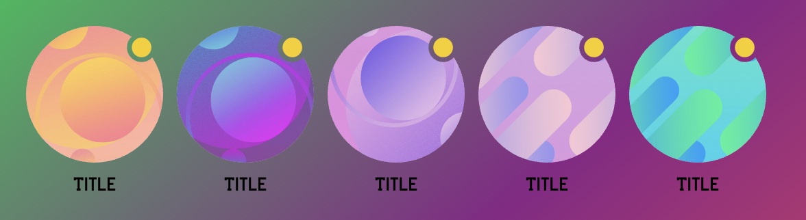

<p align="center"><a href="https://inappstory.com" target="_blank" rel="noopener noreferrer"></a></p>

# Stories Widget

This documentation is for version 2.4.0.

## Migration guide from 2.3.5 to 2.4.x
The signature of the StoriesList constructor has changed
2.3.5 version - constructor(mountSelector: string, appearanceManager: AppearanceManager, feedSlug?: string);
2.4.0 version - constructor(mountSelector: string, appearanceManager: AppearanceManager, options?: {feed?: string, testKey?: string});


## Migration guide from 2.2.x to 2.3.x
Changes event names for storiesList instance
from "startLoading" and "endLoading" to "startLoad" and "endLoad"

The status of loading storiesList is added to "endLoad" event

Field "read" in [Slider card item options](#slider-card-options) changed to "opened"

For use custom feed - pass feedSlug as third argument to StoriesList constructor
Value by default - "default"
const storiesList = new storyManager.StoriesList("#stories_widget", appearanceManager, "customFeed");


## Introduction

Web-sdk API lets you embed a Stories` widget on your website and control it using JavaScript.

## Getting started

```html
<!DOCTYPE html>
<html>
<body>
<!-- 1. The <iframe> (and Stories` widget) will be mounted to this <div> tag -->
<div id="stories_widget"></div>

<script>
  // 2. This code loads the web-sdk API code asynchronously 
  // and create queue in global var window.IASReady.

  window.IASReady = (function (d, s, id) {
    var js, fjs = d.getElementsByTagName(s)[0], st = window.IASReady || {};
    if (d.getElementById(id)) return st;
    js = d.createElement(s);
    js.id = id;
    js.src = "https://sdk.inappstory.com/v2.4.0/dist/js/IAS.js";
    js.async = true;
    fjs.parentNode.insertBefore(js, fjs);
    st._e = [];
    st.ready = function (f) {
      st._e.push(f);
    };
    return st;
  }(document, "script", "ias-wjs"));

  // 3. This function creates an StoryManager instance (and StoriesList widget)
  //    after the API code downloads.
  window.IASReady.ready(function () {

    const storyManagerConfig = {
      apiKey: "{project-integration-key}",
      userId: "kdijhud4454d", // usually - hash from real user identifier
      tags: [], // Array<string>
      placeholders: {
        user: "Guest"
      },
      lang: "ru"
    };

    // StoryManager singleton instance
    const storyManager = new window.IAS.StoryManager(storyManagerConfig);

    // AppearanceManager instance
    const appearanceManager = new window.IAS.AppearanceManager();

    // appearance config
    appearanceManager.setCommonOptions({
      hasLike: true,
      hasFavorite: true
    })
      .setStoriesListOptions({
        title: {
          content: 'The best stories',
          color: '#000',
          font: 'normal',
          marginBottom: 20,
        },
        card: {
          title: {
            color: 'black',
            font: '14px/16px "Segoe UI Semibold"',
            padding: 8
          },
          gap: 10,
          height: 100,
          variant: 'quad',
          border: {
            radius: 20,
            color: 'blue',
            width: 2,
            gap: 3,
          },
          boxShadow: null,
          opacity: 1,
          mask: {
            color: 'rgba(34, 34, 34, 0.3)'
          },
          opened: {
            border: {
              radius: null,
              color: 'red',
              width: null,
              gap: null,
            },
            boxShadow: null,
            opacity: null,
            mask: {
              color: 'rgba(34, 34, 34, 0.1)'
            },
          },
        },
        // favoriteCard: {},
        layout: {
          height: 0,
          backgroundColor: 'transparent'
        },
        sidePadding: 20,
        topPadding: 20,
        bottomPadding: 20,
        bottomMargin: 17,
        navigation: {
          showControls: false,
          controlsSize: 48,
          controlsBackgroundColor: 'white',
          controlsColor: 'black'
        },
      })
      .setStoryReaderOptions({
        closeButtonPosition: 'right',
        scrollStyle: 'flat',
        sharePanel: {
            targets: ["facebook", "twitter", "vk", "linkedin"]
        }
      }).setStoryFavoriteReaderOptions({
        title: {
            content: "Favorite",
            color: "white",
            font: "14px/16px InternalPrimaryFont"
        }
    });

    // mount and start StoriesList widget
    // #stories_widget - html element selectors
    const storiesList = new storyManager.StoriesList("#stories_widget", appearanceManager, {feed: "default"});

    // 4. Override default loading animation
    storiesList.on('startLoad', loaderContainer => loaderContainer.style.background = 'url("https://inappstory.com/stories/loader.gif") center / 45px auto no-repeat transparent');
    storiesList.on('endLoad', (loaderContainer, loadedStoriesLength) => {
      loaderContainer.style.background = 'none';
      // {defaultListLength: number, favoriteListLength: number}
      console.log({loadedStoriesLength});
    });
    
    // 5. Show onboarding example
    // showOnboardingStories(appearanceManager: AppearanceManager, customTags?: string)
    // customTags - for override tags from storyManager
    storyManager.showOnboardingStories(appearanceManager).then(result => {
       console.log({showOnboardingStoriesResult: result});
       // result: boolean - were onboarding or not
    });
    // or window.IAS.StoryManager.getInstance()
      
    // 6. Add events for internal statistics (optional)
    const publicEvents = ['clickOnStory', 'showSlide', 'showStory', 'closeStory', 'clickOnButton', 'likeStory', 'dislikeStory', 'favoriteStory', 'shareStory', 'shareStoryWithPath'];
    publicEvents.forEach((eventName) => storyManager.on(eventName, (payload) => console.log("event", eventName, payload)));


  });


</script>
</body>
</html>
```

1. The `<div>` tag in this section identifies the location on the page where the web-sdk API will place the Stories
   widget. The constructor for the widget object, which is described in the Loading a Stories widget section, identifies
   the `<div>` tag by its id to ensure that the API places the `<iframe>` in the proper location.

2. The code in this section loads the web-sdk API JavaScript code. The example uses DOM modification to download the API
   code to ensure that the code is retrieved asynchronously. (The `<script>` tag's async attribute, which also enables
   asynchronous downloads, is not yet supported in all modern browsers as discussed in
   this [Stack Overflow answer](https://stackoverflow.com/a/1834129).

3. this function creates a widget constructor and adds it to the queue waiting for the API to load

4. The code in this section listens for the start and end events of the story feed widget. When loading starts - adds
   animation and removes when finished.

--- 

## Onboarding only example

```html
<!DOCTYPE html>
<html>
<body>
<!-- 1. The <iframe> (and Stories` widget) will be mounted to this <div> tag -->
<div id="stories_widget"></div>

<script>
  // 2. This code loads the web-sdk API code asynchronously 
  // and create queue in global var window.IASReady.

  window.IASReady = (function (d, s, id) {
    var js, fjs = d.getElementsByTagName(s)[0], st = window.IASReady || {};
    if (d.getElementById(id)) return st;
    js = d.createElement(s);
    js.id = id;
    js.src = "https://sdk.inappstory.com/v2.4.0/dist/js/IAS.js";
    js.async = true;
    fjs.parentNode.insertBefore(js, fjs);
    st._e = [];
    st.ready = function (f) {
      st._e.push(f);
    };
    return st;
  }(document, "script", "ias-wjs"));

  // 3. This function creates an StoryManager instance (and StoriesList widget)
  //    after the API code downloads.
  window.IASReady.ready(function () {

    const storyManagerConfig = {
      apiKey: "{project-integration-key}",
      userId: "kdijhud4454d", // usually - hash from real user identifier
      tags: [], // Array<string>
      placeholders: {
        user: "Guest"
      },
      lang: "ru"
    };

    // StoryManager singleton instance
    const storyManager = new window.IAS.StoryManager(storyManagerConfig);

    // AppearanceManager instance
    const appearanceManager = new window.IAS.AppearanceManager();

    // appearance config
    appearanceManager.setCommonOptions({
      hasLike: true,
      hasFavorite: true
    })
      .setStoryReaderOptions({
        closeButtonPosition: 'right',
        scrollStyle: 'flat',
        sharePanel: {
            targets: ["facebook", "twitter", "vk", "linkedin"]
        }
      });

    // 4. Show onboarding example
    // showOnboardingStories(appearanceManager: AppearanceManager, customTags?: Array<string>)
    // customTags - for override tags from storyManager
    window.IAS.StoryManager.getInstance().showOnboardingStories(appearanceManager).then(result => {
       console.log({showOnboardingStoriesResult: result});
       // result: boolean - were onboarding or not
    });

  });
  
</script>
</body>
</html>
```

---

## StoryManager public methods
```ts
type StoryManagerConfig = {
  apiKey: string;
  userId?: Optional<string|number>;
  tags?: Optional<Array<string>>;
  placeholders?: Optional<Dict<string>>;
  lang?: Optional<'ru' | 'en'>;
};

type StoryManagerCallbackPayload<T> = {src: 'storiesList' | 'storyReader', data: T};

enum StoriesEvents {
  CLICK_ON_STORY = 'clickOnStoryLink',
};

interface EventPayloadDataNameMap {
  "clickOnStoryLink": {id: number, index: number, url: string};
};

type StoryManagerCallbacks = {
  storyLinkClickHandler: (payload: StoryManagerCallbackPayload<{id: number, index: number, url: string}>) => void;
};

interface StoryManager {
  (config: StoryManagerConfig, callbacks?: StoryManagerCallbacks): StoryManager;
  getInstance(): StoryManager; // static
  setTags(tags: Array<string>): void;
  setUserId(userId: string | number): void;
  setLang(lang: 'ru' | 'en'): void;
  setPlaceholders(placeholders: Dict<string>): void;
  showStory(id: number | string, appearanceManager: AppearanceManager): Promise<boolean>;
  closeStoryReader(): void;
  showOnboardingStories(appearanceManager: AppearanceManager, customTags?: Array<string>): Promise<boolean>;
  
  // callbaks
  set storyLinkClickHandler(payload: StoryManagerCallbackPayload<{id: number, index: number, url: string}>);
  
  // events
  on<K extends keyof EventPayloadDataNameMap>(event: K, listener: (payload: StoryManagerCallbackPayload<EventPayloadDataNameMap[K]>) => void): StoryManager;
  once<K extends keyof EventPayloadDataNameMap>(event: K, listener: (payload: StoryManagerCallbackPayload<EventPayloadDataNameMap[K]>) => void): StoryManager;

}

interface StoriesList {
  (mountSelector: string, appearanceManager: AppearanceManager, feedSlugOrId: string|number): StoriesList;
  reload(options: {needLoader: boolean} = {needLoader: true}): Promise<boolean>;
}
```

### StoryReader btnClickHandler example
```js
storyManager.on("clickOnStoryLink", payload => {
   const url = payload.data.url;
   if (url.indexOf('custom-schema://') === 0) {
       // run custom action
   } else {
     window.open(url, '_self');
   }
});

```


### StoriesList reload example
```js
const storiesList = new storyManager.StoriesList("#stories_widget", appearanceManager);

storyManager.setTags(['msk']);

storiesList.reload();
// or without loader animation
// storiesList.reload({needLoader: false});

```

### Show single story example
```js

// StoryManager singleton instance
const storyManager = new window.IAS.StoryManager(storyManagerConfig);

// or get previously created (from page layout for example)
const storyManager = window.IAS.StoryManager.getInstance();

// AppearanceManager instance
const appearanceManager = new window.IAS.AppearanceManager();

// appearance config
appearanceManager.setCommonOptions({
  hasLike: true,
  hasFavorite: true
})
  .setStoryReaderOptions({
    closeButtonPosition: 'right',
    scrollStyle: 'flat',
    sharePanel: {
        targets: ["facebook", "twitter", "vk", "linkedin"]
    }
  });

storyManager.showStory(125, appearanceManager).then(result => {
  console.log({showStoryResult: result});
});

```


--- 

## storyManagerConfig

| Variable     | Type                             | Description                                                                           |
|--------------|----------------------------------|---------------------------------------------------------------------------------------|
| apiKey       | string                           | Your project integration key                                                          |
| userId       | string &#124; number &#124; null | User id                                                                               |
| tags         | Array<string>                    | Array of tags                                                                         |
| placeholders | object                           | Dict for replace placeholders inside story content or title. Example: {user: "Guest"} |
| lang         | 'ru' &#124; 'en'                 | User locale                                                                           |

## AppearanceManager - StoriesListOptions

| Variable      | Type   | Description                                                                         |
|---------------|--------|-------------------------------------------------------------------------------------|
| title         | object | [Slider title options](#slider-title-options)                                       |
| card          | object | [Slider card item options](#slider-card-options)                                    |
| favoriteCard  | object | [Slider favorite card additional options](#slider-favorite-card-additional-options) |
| layout        | object | [Slider layout options](#slider-layout-options)                                     |
| sidePadding   | number | Slider side padding, `px`. Default 20                                               |
| topPadding    | number | Slider top padding, `px`. Default 20                                                |
| bottomPadding | number | Slider bottom padding, `px`. Default 20                                             |
| bottomMargin  | number | Slider bottom margin, `px`. Default 17                                              |
| navigation    | object | [Slider navigation options](#slider-navigation-options)                             |

### Slider title options

| Variable     | Type               | Description                                                                                                                                                                                                                                             |
|--------------|--------------------|---------------------------------------------------------------------------------------------------------------------------------------------------------------------------------------------------------------------------------------------------------|
| content      | string &#124; null | Title text. Default null. Title block hidden when value is empty                                                                                                                                                                                        |
| color        | string             | CSS valid color value. Default `#ffffff`                                                                                                                                                                                                                |
| marginBottom | number             | Title block bottom margin, `px`. Default 20                                                                                                                                                                                                             |
| font         | string             | CSS valid font [value](https://developer.mozilla.org/en-US/docs/Web/CSS/font). Override font. <br/>Default `bold 20px/20px InternalPrimaryFont` where InternalPrimaryFont - primary font, loaded in [project settings](https://console.inappstory.com). | 

### Slider layout options

| Variable        | Type               | Description                                                                                    |
|-----------------|--------------------|------------------------------------------------------------------------------------------------|
| height          | number &#124; null | Slider total height, `px`. `0` - for auto height. Default `0`                                  |
| backgroundColor | string             | Default `transparent`                                                                          |
| sliderAlign     | string             | Horizontal align slider inside widget, variants: `left`, `center` and `right`. Default `left`. |

### Slider card options

| Variable        | Type                 | Description                                                                                                                                                                                                                                                                                                                                                                                                                                                     |
|-----------------|----------------------|-----------------------------------------------------------------------------------------------------------------------------------------------------------------------------------------------------------------------------------------------------------------------------------------------------------------------------------------------------------------------------------------------------------------------------------------------------------------|
| title           | object               | See below                                                                                                                                                                                                                                                                                                                                                                                                                                                       |
| title.display   | boolean              | Determines whether to show the title or not                                                                                                                                                                                                                                                                                                                                                                                                                     |
| title.position  | string               | Title position. Variants: `cardInsideBottom` (inside card, at bottom), `cardOutsideTop` (above the card) and `cardOutsideBottom`(under the card). Default - `cardInsideBottom`<br/> Note when using the `cardOutsideTop` or `cardOutsideBottom` option you must manually specify a [Slider layout height](#slider-layout-options) value. Usually this is the height of the card plus card title lineHeight * card title lineClamp + card title vertical padding |
| title.textAlign | string               | Text in title horizontal align, variants: `left`, `center` and `right`. Default `left`.                                                                                                                                                                                                                                                                                                                                                                         |
| title.lineClamp | number               | Numbers of text lines. Default 3.                                                                                                                                                                                                                                                                                                                                                                                                                               |
| title.color     | string               | CSS valid color value. Default `#ffffff`                                                                                                                                                                                                                                                                                                                                                                                                                        |
| title.padding   | number &#124; string | Number, `px` eq for all sides. <br/>String - valid css, for customizing each side. Default `15`                                                                                                                                                                                                                                                                                                                                                                 |
| title.font      | string               | CSS valid font [value](https://developer.mozilla.org/en-US/docs/Web/CSS/font). Override font. <br/>Default `normal 1rem InternalPrimaryFont` where InternalPrimaryFont - primary font, loaded in [project settings](https://console.inappstory.com).                                                                                                                                                                                                            | 
| gap             | number               | Space between cards, `px`. Default `10`                                                                                                                                                                                                                                                                                                                                                                                                                         |
| height          | number               | Card height, `px`. Default `70`                                                                                                                                                                                                                                                                                                                                                                                                                                 |
| variant         | string               | Card style, one of `circle`, `quad`, `rectangle`. Default `circle`                                                                                                                                                                                                                                                                                                                                                                                              |
| border          | object               | See below                                                                                                                                                                                                                                                                                                                                                                                                                                                       |
| border.radius   | number               | Card border radius, `px`. Default `0`                                                                                                                                                                                                                                                                                                                                                                                                                           |
| border.color    | string               | Card border color, valid css. Default `black`                                                                                                                                                                                                                                                                                                                                                                                                                   |
| border.width    | number               | Card border width, `px`. Default `2`                                                                                                                                                                                                                                                                                                                                                                                                                            |
| border.gap      | number               | Space between card and border, `px`. Default `3`                                                                                                                                                                                                                                                                                                                                                                                                                |
| boxShadow       | string &#124; null   | Card box-shadow, valid css value. Default `null`                                                                                                                                                                                                                                                                                                                                                                                                                |
| dropShadow      | string &#124; null   | Card drop-shadow, valid css value. Example - `1px 2px 8px rgba(34, 34, 34, 0.3)`. Default `null`. Since v2.4.0                                                                                                                                                                                                                                                                                                                                                              |
| opacity         | number               | Card opacity. Default `null`                                                                                                                                                                                                                                                                                                                                                                                                                                    |
| mask            | object &#124; null   | Card mask - overlay between card image and title. CSS valid color. Example - `rgba(0,0,0,.3)`. Default `null`                                                                                                                                                                                                                                                                                                                                                   |
| svgMask         | object &#124; null   | [Options](#slider-card-svg-masked-overlay) for card overlay with svg masks. Since v2.4.0                                                                                                                                                                                                                                                                                                                                                                        |
| opened          | object &#124; null   | Contain keys: `border`, `boxShadow`, `opacity`, `mask` <br />Apply this values (if current value not null) on card in `opened` state. Default all values null                                                                                                                                                                                                                                                                                                   |


### Slider card svg masked overlay
Used to create effects like in the screenshot below

<figure style="    border: thin #c0c0c0 solid;
    display: flex;
    flex-flow: column;
    padding: 5px;
    max-width: 400px;">

<figcaption style="    background-color: #222;
    color: #fff;
    font: italic smaller sans-serif;
    padding: 3px;
    text-align: center;"><a href="https://stackblitz.com/edit/angular-ivy-rcv1vf?file=src/app/app.component.ts" target="_blank">Live Demo</a></figcaption>
</figure>

| Variable    | Type                               | Description                                 |
|-------------|------------------------------------|---------------------------------------------|
| cardMask    | string &#124; null                 | Svg source. Default null.                   |
| overlayMask | Array<OverlayMaskItem> &#124; null | Array of card overlay masks. Default null.  |


type OverlayMaskItem

| Variable   | Type               | Description                                                                                                       |
|------------|--------------------|-------------------------------------------------------------------------------------------------------------------|
| mask       | string &#124; null | Svg source. Default null.                                                                                         |
| background | string &#124; null | CSS color or any [background options](https://developer.mozilla.org/en-US/docs/Web/CSS/background). Default null. |

Note
Svg mask must match the size and shape of the card
The transparent part of the mask will cut out the content below it
svg tag should have width="100%" height="auto" and xmlns="http://www.w3.org/2000/svg" attributes

Example
```js
// Properties are shown only for svg masks
appearanceManager.setStoriesListOptions({
    svgMask: {
        cardMask: `<svg width="100%" height="auto" viewBox="0 0 140 140" fill="none" xmlns="http://www.w3.org/2000/svg">
<path fill-rule="evenodd" clip-rule="evenodd" d="M131 39C129 38 125.277 38 122 38C117.037 38 112.5 37 108.5 33.5C104.5 30 102 24.0824 102 18C102 14.5 102.5 11.5 100.5 8C94.5 2.5 82.416 0 70 0C31.3398 0 0 31.3401 0 70C0 108.66 31.3398 140 70 140C108.66 140 140 108.66 140 70C140 57.5848 137 45.5 131 39Z" fill="black"/>
</svg>`,
        overlayMask: [{
            mask: `<svg width="100%" height="auto" viewBox="0 0 140 140" fill="none" xmlns="http://www.w3.org/2000/svg">
<path d="M129 21C129 26.5228 124.523 31 119 31C113.477 31 109 26.5228 109 21C109 15.4772 113.477 11 119 11C124.523 11 129 15.4772 129 21Z" fill="black"/>
</svg>`,
            background: "#F2473D",
        }]
    }
});
```
<div style="display: flex;">
<figure style="    border: thin #c0c0c0 solid;
    display: flex;
    flex-flow: column;
    padding: 5px;
    max-width: 400px;">
<svg width="143px" height="143px" viewBox="0 0 140 140" fill="none" xmlns="http://www.w3.org/2000/svg" style="border: 1px solid black; margin: 10px;     max-width: 400px;
    max-height: 150px;
    align-self: center;">
<path fill-rule="evenodd" clip-rule="evenodd" d="M131 39C129 38 125.277 38 122 38C117.037 38 112.5 37 108.5 33.5C104.5 30 102 24.0824 102 18C102 14.5 102.5 11.5 100.5 8C94.5 2.5 82.416 0 70 0C31.3398 0 0 31.3401 0 70C0 108.66 31.3398 140 70 140C108.66 140 140 108.66 140 70C140 57.5848 137 45.5 131 39Z" fill="black"/>
</svg>
<figcaption style="    background-color: #222;
    color: #fff;
    font: italic smaller sans-serif;
    padding: 3px;
    text-align: center;">Card mask</figcaption>
</figure>

<figure style="    border: thin #c0c0c0 solid;
    display: flex;
    flex-flow: column;
    padding: 5px;
    max-width: 400px;">
<svg width="143px" height="143px" viewBox="0 0 140 140" fill="none" xmlns="http://www.w3.org/2000/svg" style="border: 1px solid black; margin: 10px;     max-width: 400px;
    max-height: 150px;
    align-self: center;">
<path d="M129 21C129 26.5228 124.523 31 119 31C113.477 31 109 26.5228 109 21C109 15.4772 113.477 11 119 11C124.523 11 129 15.4772 129 21Z" fill="black"/>
</svg>
<figcaption style="    background-color: #222;
    color: #fff;
    font: italic smaller sans-serif;
    padding: 3px;
    text-align: center;">Overlay mask</figcaption>
</figure>
</div>


### Slider favorite card additional options

| Variable      | Type                 | Description                                                                                                                                                                                                                                          |
|---------------|----------------------|------------------------------------------------------------------------------------------------------------------------------------------------------------------------------------------------------------------------------------------------------|
| title         | object               | See below                                                                                                                                                                                                                                            |
| title.content | string               | Card title                                                                                                                                                                                                                                           |
| title.color   | string               | CSS valid color value. Default `#000000`                                                                                                                                                                                                             |
| title.padding | number &#124; string | Number, `px` eq for all sides. <br/>String - valid css, for customizing each side. Default `15`                                                                                                                                                      |
| title.font    | string               | CSS valid font [value](https://developer.mozilla.org/en-US/docs/Web/CSS/font). Override font. <br/>Default `normal 1rem InternalPrimaryFont` where InternalPrimaryFont - primary font, loaded in [project settings](https://console.inappstory.com). | 

### Slider navigation options

By default, controls are round buttons with arrow icons at the edges of the slider

| Variable                | Type        | Description                              |
|-------------------------|-------------|------------------------------------------|
| showControls            | boolean     | Enable slider controls. Default `false`  |
| controlsSize            | number      | Button size, `px`. Default `48`          |
| controlsBackgroundColor | string      | CSS valid color value. Default `#ffffff` |
| controlsColor           | string      | CSS valid color value. Default `#000000` |

## AppearanceManager - StoryReaderOptions

| Variable                   | Type   | Description                                                                                  |
|----------------------------|--------|----------------------------------------------------------------------------------------------|
| closeButtonPosition        | string | Close button position, one of `left`, `right`                                                |
| scrollStyle                | string | Stories viewPager scroll style, one of `flat`, `cover`, `cube`                               |
| loader.default.color       | string | Default loader primary color. Valid css color. Default - white                               |
| loader.default.accentColor | string | Default loader accent color. Valid css color. Default - transparent                          |
| sharePanel                 | object | [Options](#share-panel-options) for SharePanel. Since v2.3.5                                 |
| commonBackdrop             | object | [Options](#story-reader-backdrop-options) for StoryReader backdrop. Since v2.4.0             |
| slideBackdrop              | object | [Options](#story-reader-slide-backdrop-options) for StoryReader slide backdrop. Since v2.4.0 |

## Share panel options

| Variable | Type          | Description                                                                                                               |
|----------|---------------|---------------------------------------------------------------------------------------------------------------------------|
| targets  | Array<string> | Available values: "vk", "twitter", "facebook", "linkedin".<br/>Default value: \["vk", "facebook", "twitter", "linkedin"\] |

Example 
```js
// AppearanceManager instance
const appearanceManager = new window.IAS.AppearanceManager();
appearanceManager.setStoryReaderOptions({
    closeButtonPosition: "right",
    scrollStyle: "flat",
    sharePanel: {
        targets: ["facebook", "twitter", "vk", "linkedin"]
    }
});
```

## Story reader backdrop options

| Variable       | Type               | Description                                                                                            |
|----------------|--------------------|--------------------------------------------------------------------------------------------------------|
| color          | string             | StoryReader common backdrop - CSS valid color. Example - `rgba(0,0,0,.3)`. Default `rgba(51,51,51,1)`  |
| backdropFilter | string &#124; null | StoryReader common backdrop filter. Example - `blur(10px)`. Default null                               |


## Story reader slide backdrop options

| Variable               | Type          | Description                                                                                                                       |
|------------------------|---------------|-----------------------------------------------------------------------------------------------------------------------------------|
| opacity                | number        | Slide based image backdrop - opacity value. Default `.56`                                                                         |
| blur                   | number        | Slide based image backdrop - blur value. Default `30`                                                                             |
| linearGradientOverlay  | Array<string> | Slide based image backdrop - Linear gradient overlay values. Default &#91;`rgba(0, 0, 0, 0.1) 0%`, `rgba(0, 0, 0, 0.9) 100%`&#93; |

Examples
```js
const appearanceManager = new window.IAS.AppearanceManager();

// Copy of default config
appearanceManager.setStoryReaderOptions({
    commonBackdrop: {
        color: "rgba(51, 51, 51, 1)",
        backdropFilter: null
    },
    slideBackdrop: {
        opacity: .56,
        blur: 30,
        linearGradientOverlay: [
            "rgba(0, 0, 0, 0.1) 0%",
            "rgba(0, 0, 0, 0.9) 100%"
        ]
    }
});

// Translucent config without slide based backdrop image
appearanceManager.setStoryReaderOptions({
    commonBackdrop: {
        color: "rgba(51, 51, 51, .8)",
        backdropFilter: null
    },
    slideBackdrop: {
        opacity: 0,
        blur: 30,
        linearGradientOverlay: [
            "rgba(0, 0, 0, 0.1) 0%",
            "rgba(0, 0, 0, 0.9) 100%"
        ]
    }
});

// Translucent config without slide based backdrop image and parent screen blur effect
appearanceManager.setStoryReaderOptions({
    commonBackdrop: {
        color: "rgba(51, 51, 51, .2)",
        backdropFilter: "blur(5px)"
    },
    slideBackdrop: {
        opacity: 0,
        blur: 30,
        linearGradientOverlay: [
            "rgba(0, 0, 0, 0.1) 0%",
            "rgba(0, 0, 0, 0.9) 100%"
        ]
    }
});

```


## AppearanceManager - StoryFavoriteReaderOptions
since v2.3.1

| Variable       | Type | Description                                                                                                                                                                                                                                                |
|----------------|------|------------------------------------------------------------------------------------------------------------------------------------------------------------------------------------------------------------------------------------------------------------|
| title.content  | string | Title text. Default value - "Favorite".                                                                                                                                                                                                                    |
| title.color    | string | CSS valid color value. Default `white`                                                                                                                                                                                                                     |
| title.font     | string | CSS valid font [value](https://developer.mozilla.org/en-US/docs/Web/CSS/font). Override font. <br/>Default `normal 1.4rem/1.2 InternalPrimaryFont` where InternalPrimaryFont - primary font, loaded in [project settings](https://console.inappstory.com). | 


## StoryManager events

You can subscribe to events after creating the widget instance
```js
const storyManager = new window.IAS.StoryManager(storyManagerConfig);
storyManager.on('clickOnStory', payload => console.log(payload));
```

| Name                | Payload                                                              | Description                                                         |
|---------------------|----------------------------------------------------------------------|---------------------------------------------------------------------|
| clickOnStory        | { ...commonFields, index: number, isDeeplink: boolean, url?: string} | Click on story card from slider list                                |
| showStory           | { ...commonFields }                                                  | Show story (from slider or reader)                                  |
| closeStory          | { ...commonFields, action: CloseAction }                             | Close story (from reader - transition from story or click on close) |
| showSlide           | { ...commonFields, index: number }                                   | Show slide                                                          |
| clickOnButton       | { ...commonFields, index: number, url: string }                      | Click on button with external link                                  |
| likeStory           | { ...commonFields, value: boolean }                                  | Click to set (value=true) or unset (value=false) story like         |
| dislikeStory        | { ...commonFields, value: boolean }                                  | Click to set (value=true) or unset (value=false) story dislike      |
| favoriteStory       | { ...commonFields, value: boolean }                                  | Click to set (value=true) or unset (value=false) story dislike      |
| shareStory          | { ...commonFields }                                                  | Click on story sharing                                              |
| shareStoryWithPath  | { ...commonFields, url: string }                                     | Event after successful creation of the sharing path                 |
| clickOnFavoriteCell | { feed: string }                                                     | Event after successful creation of the sharing path                 |

```ts
type Option<T> = T | null;

const commonFields = {
    id: number, // story id
    title: Option<string>, // story title
    tags: Array<string>,
    slidesCount: Option<number>,
    feed: Option<string>, // feedSlug ("default", "onboarding" or custom)
    source: Option<string> // "direct" (reader was opened manual), "list" (from feed list), "favorite" (from favorite list), "onboarding" (from onboarding list) 
};

// only for "clickOnStory" event field "source" can be "list" or "favorite"


enum CloseAction {
    closeReaderByCloseBtn = "closeReaderByCloseBtn", // closed by btn with cross icon in StoryReader
    closeReaderByEscBtn = "closeReaderByEscBtn", // closed by ESC on keyboard (desktop only)
    swipeDown = "swipeDown", // closed by swipe down StoryReader (mobile only)
    swipe = "swipe", // closed by swipe on next story (mobile only)
    lastSlideClick = "lastSlideClick", // closed by first (move backward) or last (move forward) slide in story
    auto = "auto", // closed by auto transition (by timer) on next story
    externalCloseReader = "externalCloseReader" // closed by public API method StoryManager.closeStoryReader
};
```


## StoriesList events

You can subscribe to events after creating the widget instance
```js
const storyManager = new window.IAS.StoryManager(storyManagerConfig);
const storiesList = new storyManager.StoriesList("#stories_widget", appearanceManager);

storiesList.on('startLoad', loaderContainer => loaderContainer.style.background = 'url("https://inappstory.com/stories/loader.gif") center / 45px auto no-repeat transparent');
storiesList.on('endLoad', (loaderContainer, status) => {
    loaderContainer.style.background = 'none';
    console.log({status});
});

```

| Name      | Payload                                                | Description        |
|-----------|--------------------------------------------------------|--------------------|
| startLoad | loaderContainer: HTMLDivElement                        | Start list loading |
| endLoad   | loaderContainer: HTMLDivElement, status: EndLoadStatus | End list loading   |

```ts
type Option<T> = T | null;

type EndLoadStatus = {
    success: boolean // storiesList load status 
    error: Option<{ // null if status === true
        name: string // error type - enum {networkError = "networkError"}
        networkStatus: Option<number> // request status, 404 for example
        networkMessage: Option<string> // request status text, "Feed not found" for example
    }>
    feed: string|number // feed slug or id
    defaultListLength: number // loaded feed items count
    favoriteListLength: number // loaded favorite items in feed count
};

// success example
let status = {
    success: true,
    error: null,
    feed: "default",
    defaultListLength: 10,
    favoriteListLength: 0
};

// fail example
status = {
    success: false,
    error: {
        name: "networkError",
        networkStatus: 404,
        networkMessage: "Feed not found"
    },
    feed: "default",
    defaultListLength: 0,
    favoriteListLength: 0,
};

// fail example (network offline)
status = {
    success: false,
    error: {
        name: "networkError",
        networkStatus: null,
        networkMessage: null
    },
    feed: "default",
    defaultListLength: 0,
    favoriteListLength: 0,
};

```

## StoriesList testKey

Use the key for seeing Stories with status "Moderation"
The value of the key is stored in the IAS [console](https://console.inappstory.com)

Usage example

```js
const storyManager = new window.IAS.StoryManager(storyManagerConfig);
const storiesList = new storyManager.StoriesList("#stories_widget", appearanceManager, {testKey: "key"});

```